# 03 — Casos de uso

Atores conforme [01 — Requisitos funcionais](01-requisitos-funcionais.md#atores):
`CLI` cliente, `ADM` administrador, `BARB` barbeiro (perfil restrito),
`SADM` superadmin/desenvolvedor, `SIS` rotinas automáticas.

Situação segue a [legenda](README.md#legenda-de-situação).

---

## 1. Diagrama de casos de uso

```mermaid
flowchart LR
    CLI([Cliente])
    ADM([Administrador])
    BARB([Barbeiro])
    SADM([Superadmin])
    SIS([Sistema])

    subgraph Sistema[The Barbosa]
        UC01(("Consultar serviços e equipe"))
        UC02(("Agendar horário"))
        UC03(("Criar conta / autenticar"))
        UC05(("Consultar histórico"))
        UC06(("Cancelar ou remarcar agendamento"))
        UC08(("Configurar lembretes"))
        UC09(("Gerenciar dados pessoais (LGPD)"))

        UC20(("Autenticar no painel"))
        UC21(("Concluir configuração inicial"))
        UC22(("Gerir a agenda do dia"))
        UC23(("Gerir profissionais"))
        UC24(("Gerir serviços"))
        UC25(("Gerir produtos e estoque"))
        UC26(("Configurar expediente e folgas"))
        UC27(("Configurar a barbearia"))
        UC28(("Acompanhar o dashboard"))
        UC29(("Operar o caixa"))
        UC31(("Gerir comandas"))
        UC32(("Gerir clientes e bad-list"))
        UC33(("Emitir relatórios"))
        UC34(("Ver notificações do painel"))
        UC35(("Convidar profissional"))
        UC36(("Recuperar senha"))

        UC40(("Ver a própria agenda"))
        UC41(("Concluir os próprios atendimentos"))

        UC50(("Aplicar migrations"))
        UC51(("Consultar logs e saúde"))
        UC52(("Gerir backup e restauração"))

        UC60(("Enviar confirmação e avisos de status"))
        UC61(("Enviar lembretes"))
        UC62(("Atualizar a bad-list"))
    end

    CLI --- UC01
    CLI --- UC02
    CLI --- UC03
    CLI --- UC05
    CLI --- UC06
    CLI --- UC08
    CLI --- UC09

    ADM --- UC20
    ADM --- UC21
    ADM --- UC22
    ADM --- UC23
    ADM --- UC24
    ADM --- UC25
    ADM --- UC26
    ADM --- UC27
    ADM --- UC28
    ADM --- UC29
    ADM --- UC31
    ADM --- UC32
    ADM --- UC33
    ADM --- UC34
    ADM --- UC35
    ADM --- UC36

    BARB --- UC20
    BARB --- UC40
    BARB --- UC41
    BARB --- UC36

    SADM --- UC50
    SADM --- UC51
    SADM --- UC52

    SIS --- UC60
    SIS --- UC61
    SIS --- UC62
```

---

## 2. Lista de casos de uso

| UC    | Nome                                                         | Ator principal | Situação         |
| ----- | ------------------------------------------------------------ | -------------- | ---------------- |
| UC-01 | Consultar serviços, equipe e localização                     | `CLI`          | `[IMPLEMENTADO]` |
| UC-02 | Agendar horário                                              | `CLI`          | `[IMPLEMENTADO]` |
| UC-03 | Criar conta e autenticar-se                                  | `CLI`          | `[PLANEJADO]`    |
| UC-04 | Recuperar a senha da conta                                   | `CLI`          | `[PLANEJADO]`    |
| UC-05 | Consultar o próprio histórico                                | `CLI`          | `[PLANEJADO]`    |
| UC-06 | Cancelar ou remarcar o próprio agendamento                   | `CLI`          | `[PLANEJADO]`    |
| UC-07 | Repetir um agendamento anterior                              | `CLI`          | `[PLANEJADO]`    |
| UC-08 | Configurar lembretes                                         | `CLI`          | `[PLANEJADO]`    |
| UC-09 | Gerenciar dados pessoais e privacidade (LGPD)                | `CLI`          | `[PLANEJADO]`    |
| UC-20 | Autenticar no painel                                         | `ADM` `BARB`   | `[IMPLEMENTADO]` |
| UC-21 | Concluir a configuração inicial (bootstrap)                  | `ADM`          | `[IMPLEMENTADO]` |
| UC-22 | Gerir a agenda do dia                                        | `ADM` `BARB`   | `[PARCIAL]`      |
| UC-23 | Gerir profissionais                                          | `ADM`          | `[PARCIAL]`      |
| UC-24 | Gerir serviços                                               | `ADM`          | `[IMPLEMENTADO]` |
| UC-25 | Gerir produtos e estoque                                     | `ADM`          | `[PARCIAL]`      |
| UC-26 | Configurar expediente e folgas                               | `ADM`          | `[PARCIAL]`      |
| UC-27 | Configurar a barbearia e as regras de agendamento            | `ADM`          | `[IMPLEMENTADO]` |
| UC-28 | Acompanhar o dashboard                                       | `ADM`          | `[PARCIAL]`      |
| UC-29 | Operar o caixa                                               | `ADM`          | `[PLANEJADO]`    |
| UC-30 | Registrar o pagamento de um atendimento                      | `ADM` `BARB`   | `[PLANEJADO]`    |
| UC-31 | Gerir comandas                                               | `ADM` `BARB`   | `[PLANEJADO]`    |
| UC-32 | Gerir clientes e a bad-list                                  | `ADM`          | `[PLANEJADO]`    |
| UC-33 | Emitir relatórios                                            | `ADM`          | `[PARCIAL]`      |
| UC-34 | Ver notificações do painel                                   | `ADM`          | `[PLANEJADO]`    |
| UC-35 | Convidar profissional e reenviar convite                     | `ADM`          | `[IMPLEMENTADO]` |
| UC-36 | Recuperar a senha do painel                                  | `ADM` `BARB`   | `[IMPLEMENTADO]` |
| UC-37 | Configurar o segundo fator (2FA), obrigatório                | `ADM` `SADM`   | `[PLANEJADO]`    |
| UC-40 | Ver a própria agenda                                         | `BARB`         | `[PLANEJADO]`    |
| UC-41 | Concluir os próprios atendimentos (o `no-show` é automático) | `BARB`         | `[PLANEJADO]`    |
| UC-42 | Gerir o próprio perfil (e-mail e senha)                      | `ADM` `BARB`   | `[IMPLEMENTADO]` |
| UC-50 | Aplicar migrations                                           | `SADM`         | `[IMPLEMENTADO]` |
| UC-51 | Consultar logs e a saúde do sistema                          | `SADM`         | `[PARCIAL]`      |
| UC-52 | Gerir backup e restauração                                   | `SADM`         | `[PLANEJADO]`    |
| UC-60 | Enviar confirmação e avisos de status ao cliente             | `SIS`          | `[PLANEJADO]`    |
| UC-61 | Enviar lembretes                                             | `SIS`          | `[PLANEJADO]`    |
| UC-62 | Atualizar a bad-list                                         | `SIS`          | `[PLANEJADO]`    |
| UC-63 | Gerar notificação administrativa                             | `SIS`          | `[PLANEJADO]`    |
| UC-64 | Limpar a tabela do limitador                                 | `SIS`          | `[IMPLEMENTADO]` |

---

## 3. Casos de uso detalhados (núcleo)

### UC-02 — Agendar horário `[IMPLEMENTADO]`

- **Ator:** `CLI` (anônimo hoje; **autenticado** na situação alvo — RN-50).
- **Pré-condições:** existe ao menos um serviço ativo com profissional vinculado. Na situação alvo, o cliente tem conta e está autenticado.
- **Fluxo principal:**
  1. O cliente abre `/agendar` (na situação alvo, já autenticado).
  2. Escolhe o serviço.
  3. Escolhe o profissional entre os que realizam o serviço.
  4. Escolhe o dia no calendário (só dias dentro da janela e com expediente).
  5. Escolhe o horário entre os disponíveis.
  6. Informa nome e WhatsApp (hoje); na situação alvo, confere os dados da conta.
  7. Confere o resumo (serviço, profissional, data, hora, duração, valor).
  8. Confirma. O sistema revalida a disponibilidade dentro de uma transação e grava o agendamento como `pendente` ou `confirmado` conforme a configuração.
  9. O cliente vê a tela de confirmação com o botão de WhatsApp da barbearia.
- **Extensões:**
  - 0a. _(alvo)_ Cliente sem conta: é levado ao cadastro (UC-03) antes do passo 2.
  - 5a. Nenhum horário disponível: o passo mostra a lista vazia e sugere outro dia.
  - 8a. O horário foi ocupado entre a escolha e a confirmação (RN-09): erro 409, o cliente volta ao passo 5.
  - 8b. Rate limit atingido (6 tentativas / 10 min): erro 429.
- **Pós-condições:** agendamento na agenda administrativa (RF-30); na situação alvo, dispara UC-60 (confirmação por e-mail e bot).

### UC-21 — Concluir a configuração inicial (bootstrap) `[IMPLEMENTADO]`

- **Ator:** `ADM`.
- **Pré-condições:** nenhum administrador com login próprio definido; quem executa está numa sessão de bootstrap (entrou com a senha do ambiente).
- **Fluxo principal:**
  1. O administrador escolhe um profissional já cadastrado ou informa um nome novo.
  2. Informa e-mail e senha (mínimo 6 caracteres) e a confirmação.
  3. O sistema cria ou promove o barbeiro a `admin` com login, incrementa `config.sessao_versao` (derruba as sessões de bootstrap) e abre uma sessão de barbeiro para quem executou.
- **Extensões:**
  - 0a. A configuração já foi concluída: erro 409.
  - 2a. E-mail inválido, senha curta ou confirmação divergente: erro 400.
- **Pós-condições:** o sistema sai do modo bootstrap; o login passa a ser por e-mail e senha (UC-20).

### UC-22 — Gerir a agenda do dia `[PARCIAL]`

- **Ator:** `ADM` (hoje); `BARB` restrito à própria agenda na situação alvo.
- **Fluxo principal:** localizar um agendamento (régua do dia ou lista com busca e filtros) e executar uma ação: **confirmar**, **concluir**, **cancelar**, **excluir**, **encaixar** um cliente sem marcação, **remarcar**, ou abrir o **WhatsApp** do cliente.
- **Regras:** as mudanças de status seguem a máquina de estados ([09](09-maquina-de-estados.md)); concluir exige data não futura; reabrir um cancelado revalida o horário.
- **Planejado:** o `no-show` é marcado por rotina automática (RF-25, UC-62) — o operador só o **reverte** quando errado; coluna de **pagamento** na linha (RF-29); restrição por papel (RF-89).

### UC-29 — Operar o caixa `[PLANEJADO]`

- **Ator:** `ADM`.
- **Fluxo principal:**
  1. Abre o caixa do dia, informando o valor inicial.
  2. Durante o expediente, ao fechar a comanda de um atendimento concluído (UC-31), o(s) pagamento(s) entram como movimento de caixa; sangrias, reforços, troco e outras entradas/saídas avulsas são lançados à mão.
  3. Ao fim do dia, fecha o caixa: o sistema apura o total esperado e registra o valor conferido, com a diferença.
- **Regras:** um único caixa por dia para a barbearia, com movimentos tipados (RN-31); o valor de cada serviço é atribuído ao profissional que atendeu, sem comissão (RN-32).

### UC-31 — Gerir comandas `[PLANEJADO]`

- **Ator:** `ADM` `BARB`.
- **Pré-condições para fechar:** o agendamento vinculado está `concluido` (RN-33).
- **Fluxo principal:**
  1. Abre a comanda a partir de um agendamento (1:1) ou como avulsa.
  2. Acrescenta serviços realizados e produtos consumidos ou vendidos; cada produto é validado contra o estoque (RN-34).
  3. O sistema calcula o total.
  4. Fecha a comanda registrando **uma ou mais formas de pagamento** que somem o total (RN-30); o(s) pagamento(s) entram no caixa (UC-30) e o estoque dos produtos é baixado.
- **Extensões:**
  - 2a. Estoque insuficiente para um produto: o item é recusado, com aviso.
  - 4a. Agendamento ainda não `concluido`: o fechamento é bloqueado.

### UC-06 — Cancelar ou remarcar o próprio agendamento `[PLANEJADO]`

- **Ator:** `CLI` autenticado.
- **Pré-condições:** o agendamento pertence ao cliente e falta **mais de 30 minutos** para o horário (RN-22).
- **Fluxo principal (cancelar):** o cliente escolhe o agendamento no histórico e confirma o cancelamento; o status vai para `cancelado` e o horário volta a ficar disponível.
- **Fluxo principal (remarcar):** o cliente escolhe um novo dia e horário entre os disponíveis; o sistema revalida e grava a nova data mantendo o status.
- **Extensões:**
  - 0a. Faltam 30 minutos ou menos: a ação fica indisponível, com orientação para falar pelo WhatsApp.
- **Pós-condições:** na situação alvo, dispara UC-60 (aviso de status).
