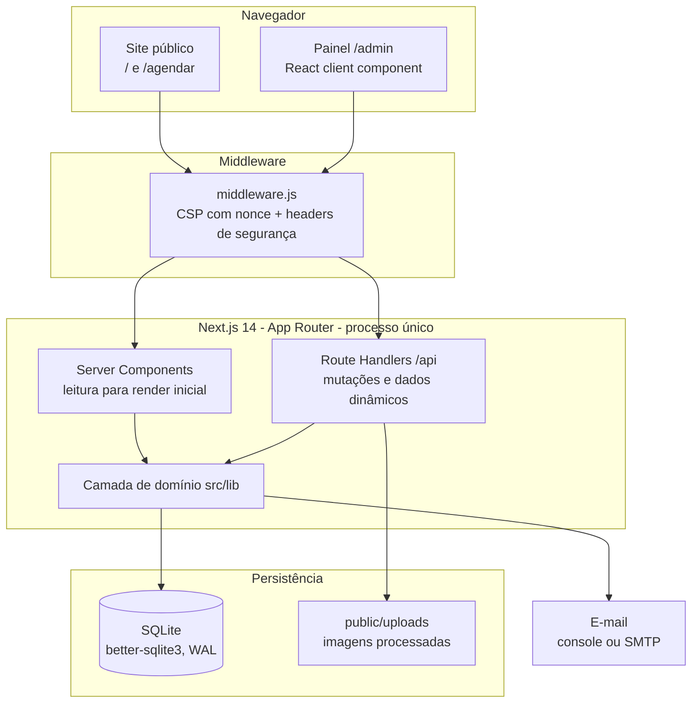
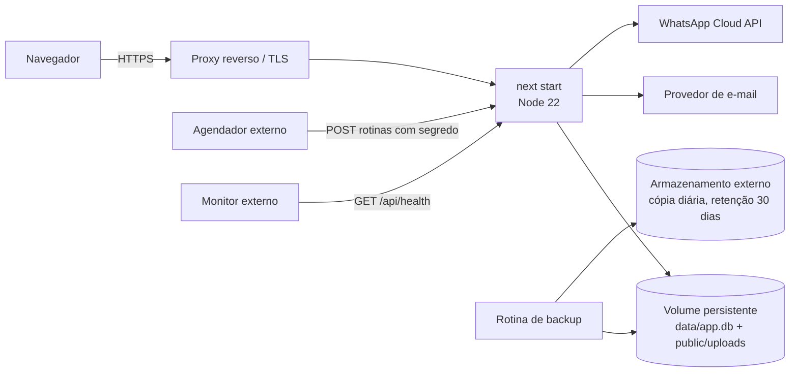

# 05 — Arquitetura da aplicação

Aplicação **Next.js 14 (App Router)** monolítica: o site público, o painel e a
API vivem no mesmo projeto e no mesmo processo. Persistência em **SQLite** por
`better-sqlite3`, sem ORM. Sem framework de UI, sem biblioteca de
autenticação, sem framework de testes.

---

## 1. Visão em camadas

**Server Components** leem o banco direto (via `src/lib/**`) para montar o HTML
inicial do site. **Route Handlers** (`src/app/api/**`) atendem tudo que é
dinâmico ou mutação: disponibilidade, criação de agendamento, e todo o painel.
O **middleware** roda em toda requisição de página e injeta a CSP com nonce.

---

## 2. Componentes

### Rotas de UI

| Rota       | Render                                | Papel                                                                                    |
| ---------- | ------------------------------------- | ---------------------------------------------------------------------------------------- |
| `/`        | Server Component + `Animacoes`        | Vitrine: capa, serviços, equipe, produtos, contato.                                      |
| `/agendar` | Client Component (`FluxoAgendamento`) | Assistente de 5 passos; consome `/api/public`, `/api/horarios`, `/api/agendamentos`.     |
| `/admin`   | Client Component (`PainelAdmin`)      | Painel inteiro numa página, com navegação lateral entre seções; consome `/api/admin/**`. |

### API — famílias de rotas

| Prefixo                                                      | Autenticação                   | Função                                                             |
| ------------------------------------------------------------ | ------------------------------ | ------------------------------------------------------------------ |
| `/api/public`                                                | nenhuma                        | Serviços, equipe e dias disponíveis para o site.                   |
| `/api/horarios`                                              | nenhuma                        | Horários livres de um par profissional + serviço num dia.          |
| `/api/agendamentos`                                          | sessão de cliente + rate limit | Recebe o agendamento do cliente (RN-50).                           |
| `/api/conta/**`                                              | sessão de cliente (mutações)   | Cadastro, login, recuperação de senha, perfil e exclusão da conta. |
| `/api/health`                                                | nenhuma                        | Health check (banco + escrita em `public/uploads`).                |
| `/api/admin/login` · `logout` · `sessao`                     | nenhuma                        | Entrada e sondagem de sessão.                                      |
| `/api/admin/bootstrap` · `esqueci-senha` · `redefinir-senha` | sessão de bootstrap ou token   | Configuração inicial e recuperação de senha.                       |
| `/api/admin/**` (demais)                                     | `exigirSessao`                 | Agenda, cadastros, configuração, resumo, upload, perfil.           |

### Camada de domínio — `src/lib/`

| Módulo               | Responsabilidade                                                                                                            |
| -------------------- | --------------------------------------------------------------------------------------------------------------------------- |
| `db.js`              | Abre a conexão SQLite (WAL, FKs on), expõe leituras e helpers. **Único ponto que conhece o banco.**                         |
| `migrations.js`      | Migrations versionadas do schema; `versaoEsperada()`.                                                                       |
| `agendamentos.js`    | Criar, remarcar, mudar status e excluir agendamento — com a máquina de estados e as transações.                             |
| `slots.js`           | Cálculo dos horários livres (`horariosLivres`).                                                                             |
| `datas-cliente.js`   | Dias disponíveis e utilidades de data no fuso da barbearia.                                                                 |
| `auth.js`            | Sessão (HMAC), scrypt, bootstrap, login por barbeiro, tokens de recuperação.                                                |
| `cliente-auth.js`    | Conta do cliente do site: sessão própria (`cliente_sessao`), cadastro, login, recuperação, anonimização. Espelha `auth.js`. |
| `limitador.js`       | Rate limiting em SQLite (por chave + disjuntor global).                                                                     |
| `auditoria.js`       | Trilha de auditoria das mutações, sem PII do cliente.                                                                       |
| `validacao.js`       | Validação central de entrada (formato, faixa, e-mail, telefone).                                                            |
| `requisicao.js`      | Leitura de corpo JSON, verificação de `Origin`.                                                                             |
| `log.js`             | Logging estruturado em stdout; wrapper `comLog` de cada handler.                                                            |
| `format.js`          | Moeda, telefone, datas, link de WhatsApp, nome padrão.                                                                      |
| `email.js`           | Envio de e-mail (`EMAIL_PROVIDER`: `console` em dev, SMTP em produção).                                                     |
| `config-ambiente.js` | Verificação de ambiente seguro em produção (`verificarAmbiente`).                                                           |

---

## 3. Aspectos transversais

- **Segurança de borda (`middleware.js`):** CSP montada por requisição com um
  nonce novo (o Next injeta scripts inline no streaming de RSC); `unsafe-eval`
  no `script-src` **só** em desenvolvimento. Acompanham `X-Frame-Options: DENY`,
  `X-Content-Type-Options: nosniff`, `Referrer-Policy` e HSTS.
- **CSRF:** rotas de mutação do painel checam que o host do header `Origin` bate
  com o `Host` (`requisicao.js`), além de `SameSite=Strict` no cookie.
- **Sessão:** cookie `admin_sessao` autocontido, assinado com HMAC-SHA256, com
  validade embutida e um número de versão (`sessao_versao` global para
  bootstrap, `barbeiros.sessao_versao` por barbeiro) que invalida cookies
  antigos sem tabela de sessões.
- **Rate limiting:** `limitador.js` — cada tentativa é uma linha em SQLite;
  janela deslizante por chave e disjuntor global no login. Limpeza amostrada.
- **Auditoria:** `auditoria.js` grava antes/depois de cada mutação de
  agendamento e das ações de conta, sem nome nem telefone do cliente.
- **Observabilidade:** `log.js` — logs estruturados em stdout; sem stack
  externa, por opção.
- **Upload:** `POST /api/admin/upload` valida a assinatura do arquivo (magic
  number), reprocessa com `sharp` (≤ 700 px, WebP) e grava com nome UUID.

---

## 4. Decisões de arquitetura

| Decisão                                      | Motivo                                                                                 | Custo aceito                                                                   |
| -------------------------------------------- | -------------------------------------------------------------------------------------- | ------------------------------------------------------------------------------ |
| **SQLite (`better-sqlite3`), sem ORM**       | Um arquivo, zero infraestrutura; `prepared statements` diretos.                        | Escritor único; migração para Postgres/Turso exigiria trocar `db.js` (RNF-11). |
| **Sem biblioteca de autenticação**           | Controle total sobre sessão, hash e invalidação; zero dependências no caminho crítico. | Código de segurança é responsabilidade do projeto; precisa de testes fortes.   |
| **Painel numa página só (client component)** | Navegação instantânea entre seções; um só ponto de estado.                             | Primeiro carregamento traz o painel inteiro.                                   |
| **CSS puro com custom properties**           | Um arquivo de tema controla site e painel; sem build de design system.                 | Sem utilitários; cada componente é feito à mão.                                |
| **Runner de teste nativo do Node**           | Sem Jest/Vitest; testes rodam com o próprio Node.                                      | Menos açúcar (mocks, snapshots); helpers escritos à mão em `tests/`.           |
| **Snapshot de nome/preço no agendamento**    | O histórico e o financeiro não mudam quando o cadastro muda (RN-10, RN-11).            | Redundância controlada entre `agendamentos` e `servicos`/`barbeiros`.          |
| **`soft delete` de agendamento**             | Preserva auditoria e financeiro (RN-29).                                               | Toda leitura precisa filtrar `excluido_em IS NULL`.                            |

---

## 5. Integrações externas `[PLANEJADO]`

| Integração                          | Uso                                                                                                                                 | Notas                                                                                                      |
| ----------------------------------- | ----------------------------------------------------------------------------------------------------------------------------------- | ---------------------------------------------------------------------------------------------------------- |
| **WhatsApp Business / Cloud API**   | Bot que comunica status de agendamento e lembretes ao cliente (RF-93, RF-95).                                                       | API oficial, número próprio da barbearia; envio assíncrono e tolerante a falha (RNF-21).                   |
| **Provedor de e-mail (SMTP)**       | Recuperação de senha (já existe) e confirmação de agendamento ao cliente (RF-94).                                                   | `EMAIL_PROVIDER=smtp` em produção; `console` em dev.                                                       |
| **Agendador externo (cron)**        | Aciona as rotinas de lembrete, marcação de `no-show` e limpeza chamando endpoints internos protegidos por segredo (RNF-22, RF-107). | Cron do provedor de hospedagem ou serviço de terceiros; o processo Node não precisa ficar de pé para elas. |
| **Armazenamento de backup externo** | Cópia diária de `data/` e `public/uploads/`, fora do ambiente principal (RNF-04).                                                   | Retenção inicial de 30 dias.                                                                               |

Nenhuma dessas integrações está no caminho síncrono de uma requisição: a falha
de qualquer provedor externo não pode derrubar o agendamento nem o painel.

---

## 6. Restrições e implicações

- **`better-sqlite3` é síncrono e o Next roda em uma thread.** Toda query
  bloqueia o event loop enquanto executa: uma consulta pesada de relatório
  congela `/api/public`, `/api/horarios` e o `POST` de agendamento para todos.
  Consequência de projeto: as consultas de resumo/caixa/relatório precisam ser
  indexadas e limitadas, e é o principal motivo para o caixa e os relatórios
  `[PLANEJADO]` nascerem com agregados prontos, não varreduras.
- **Escritor único.** Só uma transação de escrita por vez; a de agendamento usa
  `BEGIN IMMEDIATE` para pegar o lock antes de reconferir a disponibilidade.
- **Estado em disco local.** O banco (`data/`) e os uploads (`public/uploads/`)
  precisam de disco persistente — o que exclui hospedagem efêmera sem volume.
- **Disponibilidade por profissional.** `slots.js` lê o expediente de
  `expediente_barbeiro` e as `folgas_recorrentes` de cada profissional (RN-14);
  não há mais grade global de `expediente`. `diasDisponiveis()` aceita um
  `barbeiroId` (usado por `GET /api/public?barbeiro=<id>`) ou, sem ele, devolve
  a união dos profissionais ativos.

---

## 7. Topologia de implantação `[PLANEJADO]`

Hoje o sistema roda só localmente, sem ambiente de produção. Quando for para
produção:

- Servidor com disco persistente (Railway, Render, Fly.io com volume, ou VPS).
- `SESSION_SECRET` real, `NODE_ENV=production`, `TZ=America/Sao_Paulo`,
  `TRUST_PROXY=1` **só** atrás de proxy confiável, `APP_URL` público,
  `EMAIL_PROVIDER=smtp` com as credenciais do provedor, credenciais da WhatsApp
  Cloud API e o segredo dos endpoints de rotina.
- Backup automático diário de `data/` (com o WAL consolidado) e
  `public/uploads/` para um armazenamento externo ao ambiente, retenção inicial
  de 30 dias, com runbook de restauração testado (RF-105, RF-106).
