# 06 — Modelo de dados

Extraído de `src/lib/migrations.js` (8 migrations, versão esperada **8**). O
schema é SQLite; toda leitura e escrita passa por `src/lib/db.js` com
_prepared statements_, sem ORM.

- **Situação atual:** o que as 8 migrations criam.
- **Situação alvo:** as entidades novas que os módulos `[PLANEJADO]`
  (comandas, caixa, 2FA, lembretes) exigem. Ainda não existem migrations
  para elas.

Convenções do schema: dinheiro em **centavos** (`_centavos`, inteiro); datas em
`AAAA-MM-DD` e horas em `HH:MM`, validadas por `CHECK ... GLOB`; texto não
preenchido é `''` (`NOT NULL DEFAULT ''`), nunca `NULL`; `ativo`/`aberto` são
inteiros `0/1`.

---

## 1. Diagrama entidade-relacionamento — situação atual

Os `CHECK`, defaults e demais restrições estão no dicionário da seção 2. Os
comentários aqui são só uma orientação rápida.

```mermaid
erDiagram
    barbeiros {
        INTEGER id PK
        TEXT    nome
        TEXT    funcao
        TEXT    bio
        TEXT    foto
        INTEGER ativo "0 ou 1; aparece no site"
        INTEGER ordem
        TEXT    email "migration 6; unico por lower(email)"
        TEXT    senha_hash "migration 6; scrypt"
        INTEGER login_ativo "migration 6; entra no painel"
        TEXT    papel "migration 6; admin ou barbeiro"
        INTEGER sessao_versao "migration 6; invalida sessoes do barbeiro"
    }
    servicos {
        INTEGER id PK
        TEXT    nome
        TEXT    descricao
        TEXT    categoria "default Corte"
        INTEGER preco_centavos "em centavos, nao-negativo"
        INTEGER duracao_min "5 a 480"
        INTEGER ativo
        INTEGER ordem
        TEXT    imagem "migration 2"
    }
    servico_barbeiro {
        INTEGER servico_id PK, FK
        INTEGER barbeiro_id PK, FK
    }
    produtos {
        INTEGER id PK
        TEXT    nome
        TEXT    marca
        INTEGER preco_centavos "em centavos, nao-negativo"
        INTEGER estoque "nao-negativo"
        INTEGER ativo
        TEXT    imagem "migration 2"
    }
    expediente_barbeiro {
        INTEGER barbeiro_id PK, FK "migration 7; ON DELETE CASCADE"
        INTEGER dia PK "0 domingo a 6 sabado"
        INTEGER aberto
        TEXT    abre "HH:MM"
        TEXT    fecha "HH:MM; posterior a abre"
    }
    folgas_recorrentes {
        INTEGER id PK
        INTEGER barbeiro_id FK "migration 7; ON DELETE CASCADE"
        INTEGER dia_semana "0 domingo a 6 sabado; unico por barbeiro"
        TEXT    criado_em
    }
    bloqueios {
        INTEGER id PK
        INTEGER barbeiro_id FK "NULL vale para todos"
        TEXT    data "AAAA-MM-DD"
        TEXT    inicio "HH:MM"
        TEXT    fim "HH:MM; posterior a inicio"
        TEXT    motivo
    }
    clientes {
        INTEGER id PK
        TEXT    nome
        TEXT    telefone "so digitos"
        TEXT    email "migration 8; NOT NULL, unico por lower(email)"
        TEXT    senha_hash "migration 8; scrypt"
        INTEGER sessao_versao "migration 8; invalida sessoes da conta"
        TEXT    criado_em
        TEXT    anonimizado_em "preenchido = conta excluida (RN-44)"
    }
    cliente_reset_tokens {
        INTEGER id PK
        INTEGER cliente_id FK "migration 8; ON DELETE CASCADE"
        TEXT    token_hash "unico"
        TEXT    criado_em
        TEXT    expira_em
        TEXT    usado_em "NULL enquanto nao usado"
        TEXT    ip_solicitante
    }
    agendamentos {
        INTEGER id PK
        INTEGER cliente_id FK "migration 8; ON DELETE SET NULL"
        TEXT    cliente_nome "snapshot; zerado ao anonimizar (RN-44)"
        TEXT    cliente_telefone "so digitos; zerado ao anonimizar"
        INTEGER barbeiro_id FK "ON DELETE SET NULL"
        INTEGER servico_id FK "ON DELETE SET NULL"
        TEXT    barbeiro_nome "snapshot congelado"
        TEXT    servico_nome "snapshot congelado"
        TEXT    data "AAAA-MM-DD"
        TEXT    inicio "HH:MM"
        TEXT    fim "HH:MM; posterior a inicio"
        INTEGER duracao_min "5 a 480"
        INTEGER preco_centavos "em centavos, nao-negativo"
        TEXT    observacoes
        TEXT    status "pendente, confirmado, concluido, cancelado"
        TEXT    criado_em "UTC"
        TEXT    excluido_em "migration 5; NULL igual a ativo"
    }
    reset_senha_tokens {
        INTEGER id PK
        INTEGER barbeiro_id FK "ON DELETE CASCADE"
        TEXT    token_hash "unico"
        TEXT    criado_em
        TEXT    expira_em
        TEXT    usado_em "NULL enquanto nao usado"
        TEXT    ip_solicitante
    }
    limitador {
        INTEGER id PK
        TEXT    chave "login e agendamento, por chave"
        TEXT    criado_em
    }
    auditoria {
        INTEGER id PK
        TEXT    acao "criar, status, remarcar, excluir"
        TEXT    tabela
        INTEGER registro_id
        TEXT    antes "JSON; sem PII do cliente"
        TEXT    depois "JSON; sem PII do cliente"
        TEXT    criado_em
    }
    config {
        TEXT chave PK
        TEXT valor
    }
    schema_version {
        INTEGER versao "controle das migrations"
    }

    barbeiros           ||--o{ servico_barbeiro     : "realiza"
    servicos            ||--o{ servico_barbeiro     : "é realizado por"
    barbeiros           ||--o{ agendamentos         : "atende"
    servicos            ||--o{ agendamentos         : "é agendado em"
    clientes            ||--o{ agendamentos         : "marca"
    clientes            ||--o{ cliente_reset_tokens : "solicita"
    barbeiros           ||--o{ bloqueios            : "tem folga pontual"
    barbeiros           ||--|{ expediente_barbeiro  : "trabalha na semana"
    barbeiros           ||--o{ folgas_recorrentes   : "folga toda semana"
    barbeiros           ||--o{ reset_senha_tokens   : "solicita"
```

`config` e `schema_version` não têm relação com as demais — `config` é um
dicionário chave-valor e `schema_version` guarda uma linha só.

---

## 2. Dicionário de dados — situação atual

### `config` — dicionário chave-valor

Uma linha por parâmetro. Chaves usadas: `nome_barbearia`, `slogan`, `whatsapp`,
`endereco`, `instagram`, `logo_url`, `intervalo_min`, `antecedencia_min`,
`dias_futuros`, `confirmacao_automatica`, `sessao_versao`, `senha_hash`
(hash `scrypt` do painel, gravado após a troca do bootstrap).

### `expediente_barbeiro` — expediente semanal por profissional (migration 7)

Substitui a antiga tabela global `expediente` (RN-14). Uma linha por
`(profissional, dia da semana)`.

| Coluna        | Tipo    | Regras                                                   |
| ------------- | ------- | -------------------------------------------------------- |
| `barbeiro_id` | INTEGER | PK (parte). FK → `barbeiros` `ON DELETE CASCADE`.        |
| `dia`         | INTEGER | PK (parte). `CHECK BETWEEN 0 AND 6` (0 = domingo).       |
| `aberto`      | INTEGER | `0/1`. `0` fecha o dia inteiro para aquele profissional. |
| `abre`        | TEXT    | `CHECK GLOB HH:MM`.                                      |
| `fecha`       | TEXT    | `CHECK GLOB HH:MM` e `CHECK fecha > abre`.               |

PK composta `(barbeiro_id, dia)`. Todo profissional novo nasce com as 7 linhas
semeadas pelo _trigger_ `trg_expediente_barbeiro_padrao` (domingo 09–18
fechado, seg–sex 09–20, sábado 08–18); a migration 7 semeou os profissionais
já existentes a partir da grade global de então.

### `folgas_recorrentes` — dias da semana em que o profissional nunca atende (migration 7)

Distinto de `bloqueios` (exceção de uma data pontual). Um dia de folga
recorrente zera a disponibilidade daquele profissional naquele dia da semana,
mesmo com o expediente aberto (RN-49).

| Coluna        | Tipo    | Regras                                                          |
| ------------- | ------- | --------------------------------------------------------------- |
| `id`          | INTEGER | PK autoincremento.                                              |
| `barbeiro_id` | INTEGER | FK → `barbeiros` `ON DELETE CASCADE`.                           |
| `dia_semana`  | INTEGER | `CHECK BETWEEN 0 AND 6`. Único por `(barbeiro_id, dia_semana)`. |
| `criado_em`   | TEXT    | `datetime('now')`.                                              |

### `barbeiros` — profissionais e, desde a migration 6, credenciais de painel

| Coluna          | Tipo    | Regras / observação                                                                     |
| --------------- | ------- | --------------------------------------------------------------------------------------- |
| `id`            | INTEGER | PK autoincremento.                                                                      |
| `nome`          | TEXT    | Obrigatório.                                                                            |
| `funcao`        | TEXT    | Cargo exibido no site.                                                                  |
| `bio`, `foto`   | TEXT    | Conteúdo do site.                                                                       |
| `ativo`         | INTEGER | `0/1`. Controla presença no site e no agendamento.                                      |
| `ordem`         | INTEGER | Ordenação de exibição.                                                                  |
| `email`         | TEXT    | Migration 6. Único por `lower(email)` quando `email <> ''`.                             |
| `senha_hash`    | TEXT    | Migration 6. `scrypt`, com parâmetros de custo embutidos.                               |
| `login_ativo`   | INTEGER | Migration 6. Independente de `ativo`: um controla o site, o outro o acesso ao painel.   |
| `papel`         | TEXT    | Migration 6. `admin` \| `barbeiro`. Migration 6 promoveu todos os existentes a `admin`. |
| `sessao_versao` | INTEGER | Migration 6. Trocar a senha incrementa este contador e derruba as sessões do barbeiro.  |

### `servicos`

| Coluna           | Tipo    | Regras                                |
| ---------------- | ------- | ------------------------------------- |
| `id`             | INTEGER | PK autoincremento.                    |
| `nome`           | TEXT    | Obrigatório.                          |
| `descricao`      | TEXT    | —                                     |
| `categoria`      | TEXT    | Default `'Corte'`.                    |
| `preco_centavos` | INTEGER | `CHECK >= 0`.                         |
| `duracao_min`    | INTEGER | `CHECK BETWEEN 5 AND 480`.            |
| `ativo`          | INTEGER | `0/1`.                                |
| `ordem`          | INTEGER | —                                     |
| `imagem`         | TEXT    | Migration 2. Caminho local do upload. |

### `servico_barbeiro` — quais serviços cada profissional realiza

PK composta `(servico_id, barbeiro_id)`. Ambas as FKs com `ON DELETE CASCADE`.
Um serviço sem nenhuma linha aqui não aparece no site (RN-12).

### `produtos`

| Coluna           | Tipo    | Regras                                            |
| ---------------- | ------- | ------------------------------------------------- |
| `id`             | INTEGER | PK autoincremento.                                |
| `nome`           | TEXT    | Obrigatório.                                      |
| `marca`          | TEXT    | —                                                 |
| `preco_centavos` | INTEGER | `CHECK >= 0`.                                     |
| `estoque`        | INTEGER | `CHECK >= 0`. Hoje só editável à mão (ver RN-34). |
| `ativo`          | INTEGER | `0/1`.                                            |
| `imagem`         | TEXT    | Migration 2.                                      |

### `bloqueios` — folgas e fechamentos pontuais

| Coluna        | Tipo    | Regras                                                                 |
| ------------- | ------- | ---------------------------------------------------------------------- |
| `id`          | INTEGER | PK autoincremento.                                                     |
| `barbeiro_id` | INTEGER | FK → `barbeiros` `ON DELETE CASCADE`. `NULL` = bloqueia todos (RN-06). |
| `data`        | TEXT    | `CHECK GLOB AAAA-MM-DD`.                                               |
| `inicio`      | TEXT    | `CHECK GLOB HH:MM`.                                                    |
| `fim`         | TEXT    | `CHECK GLOB HH:MM` e `CHECK fim > inicio`.                             |
| `motivo`      | TEXT    | Texto livre.                                                           |

Índice: `idx_bloq_data(data)`.

### `agendamentos`

| Coluna             | Tipo    | Regras / observação                                                                                                           |
| ------------------ | ------- | ----------------------------------------------------------------------------------------------------------------------------- |
| `id`               | INTEGER | PK autoincremento.                                                                                                            |
| `cliente_id`       | INTEGER | Migration 8. FK → `clientes` `ON DELETE SET NULL`. Preenchido no agendamento pelo site; `NULL` no encaixe pelo painel.        |
| `cliente_nome`     | TEXT    | _Snapshot_ do nome no momento da marcação (≥ 2, limitado a 80). Zerado para "Cliente removido" ao anonimizar a conta (RN-44). |
| `cliente_telefone` | TEXT    | Só dígitos. Vem da conta no site (10–11 dígitos); opcional no encaixe. Zerado ao anonimizar.                                  |
| `barbeiro_id`      | INTEGER | FK → `barbeiros` `ON DELETE SET NULL`.                                                                                        |
| `servico_id`       | INTEGER | FK → `servicos` `ON DELETE SET NULL`.                                                                                         |
| `barbeiro_nome`    | TEXT    | Snapshot no momento da marcação (RN-10).                                                                                      |
| `servico_nome`     | TEXT    | Snapshot no momento da marcação (RN-10).                                                                                      |
| `data`             | TEXT    | `CHECK GLOB AAAA-MM-DD`.                                                                                                      |
| `inicio`, `fim`    | TEXT    | `CHECK GLOB HH:MM`; `CHECK fim > inicio`. `fim = inicio + duracao_min`.                                                       |
| `duracao_min`      | INTEGER | `CHECK BETWEEN 5 AND 480`.                                                                                                    |
| `preco_centavos`   | INTEGER | `CHECK >= 0`. Preço do serviço no momento da marcação (RN-11).                                                                |
| `observacoes`      | TEXT    | Limitado a 300.                                                                                                               |
| `status`           | TEXT    | `CHECK IN ('pendente','confirmado','concluido','cancelado')`. Ver [09](09-maquina-de-estados.md).                             |
| `criado_em`        | TEXT    | `datetime('now')` — **UTC**.                                                                                                  |
| `excluido_em`      | TEXT    | Migration 5. `NULL` = ativo; preenchido = _soft delete_ (RN-29).                                                              |

Índices: `idx_ag_data(data)`, `idx_ag_barbeiro(barbeiro_id, data)` e o índice
único parcial **`idx_ag_sem_duplicidade(barbeiro_id, data, inicio) WHERE status <> 'cancelado'`**
(migration 4) — a garantia final contra agendamento duplicado (RN-09).

### `clientes` — conta do cliente do site (migration 8)

| Coluna           | Tipo    | Regras / observação                                                   |
| ---------------- | ------- | --------------------------------------------------------------------- |
| `id`             | INTEGER | PK autoincremento.                                                    |
| `nome`           | TEXT    | `NOT NULL DEFAULT ''`. ≥ 2 no cadastro; `''` após anonimização.       |
| `telefone`       | TEXT    | Só dígitos. Obrigatório no cadastro (10–11 dígitos).                  |
| `email`          | TEXT    | `NOT NULL DEFAULT ''`. Único por `lower(email)` quando `email <> ''`. |
| `senha_hash`     | TEXT    | `scrypt`, mesmo formato do painel.                                    |
| `sessao_versao`  | INTEGER | Trocar a senha ou anonimizar sobe este contador e derruba as sessões. |
| `criado_em`      | TEXT    | `datetime('now')`.                                                    |
| `anonimizado_em` | TEXT    | `NULL` = conta ativa; preenchido = excluída a pedido (RN-44).         |

### `cliente_reset_tokens` — recuperação de senha do cliente (migration 8)

Mesma técnica de `reset_senha_tokens` (só o hash do token é guardado). FK →
`clientes` `ON DELETE CASCADE`; índice único `idx_cliente_reset_token_hash` e
índice `idx_cliente_reset_cliente_expira(cliente_id, expira_em)`.

### `reset_senha_tokens` — recuperação de senha do barbeiro (migration 6)

| Coluna           | Tipo    | Regras                                              |
| ---------------- | ------- | --------------------------------------------------- |
| `id`             | INTEGER | PK autoincremento.                                  |
| `barbeiro_id`    | INTEGER | FK → `barbeiros` `ON DELETE CASCADE`.               |
| `token_hash`     | TEXT    | Hash do token; índice único `idx_reset_token_hash`. |
| `criado_em`      | TEXT    | `datetime('now')`.                                  |
| `expira_em`      | TEXT    | Prazo de validade.                                  |
| `usado_em`       | TEXT    | `NULL` enquanto não consumido.                      |
| `ip_solicitante` | TEXT    | Para rastreio de abuso.                             |

Índice: `idx_reset_barbeiro_expira(barbeiro_id, expira_em)`.

### `limitador` — controle de taxa (migration 1)

Uma linha por tentativa. `chave` identifica o alvo (login, agendamento
público). A janela de tempo sobre `criado_em` decide se a próxima passa.
Limpeza amostrada (1 em 100 chamadas). Índice: `idx_limitador_chave(chave, criado_em)`.

### `auditoria` — trilha das mutações de agendamento (migration 5)

`antes` e `depois` são JSON com campos operacionais (status, data, horário,
ids, preço). **Nunca** nome ou telefone do cliente (RN-43). Índice:
`idx_auditoria_tabela_registro(tabela, registro_id)`.

### `schema_version`

Uma linha, sem PK. `aplicarMigrations()` faz `DELETE` + `INSERT` a cada
migration aplicada; `getDb()` recusa subir se o valor não for `8`.

---

## 3. Entidades da situação alvo `[PLANEJADO]`

Estas entidades ainda não existem. A lista fixa o vocabulário e as ligações
esperadas; o desenho fino sai quando o módulo for implementado.

| Entidade             | Papel                                                                                                                                                                                                             | Liga-se a                                                 |
| -------------------- | ----------------------------------------------------------------------------------------------------------------------------------------------------------------------------------------------------------------- | --------------------------------------------------------- |
| `lembretes`          | Antecedência do lembrete por cliente ou por agendamento (15 min … 24 h) e controle de envio (canal, `enviado_em`).                                                                                                | `clientes`, `agendamentos`                                |
| `formas_pagamento`   | Cadastro de formas de pagamento aceitas (dinheiro, Pix, débito, crédito…).                                                                                                                                        | `pagamentos`                                              |
| `caixa_sessoes`      | Abertura e fechamento do caixa do dia, um por dia para a barbearia (RN-31): `data`, `aberto_em`, `fechado_em`, `valor_abertura`, `valor_fechamento`, `diferenca`.                                                 | `caixa_movimentos`                                        |
| `caixa_movimentos`   | Movimentos do caixa: `valor_centavos`, `tipo` (`sangria`, `reforco`, `troco`, `entrada_avulsa`, `saida_avulsa`, `pagamento` — RN-31), `descricao`, `pagamento_id?`.                                               | `caixa_sessoes`, `pagamentos`                             |
| `pagamentos`         | Um pagamento de uma comanda: `comanda_id`, `forma_pagamento_id`, `valor_centavos`, `registrado_em`. Uma comanda tem **1..N** pagamentos (RN-30). O executante do serviço vem da comanda / do agendamento (RN-32). | `comandas`, `formas_pagamento`, `caixa_movimentos`        |
| `comandas`           | 1:1 com `agendamentos` ou avulsa (RN-33): `cliente_id`, `agendamento_id` (nullable), `status` (`aberta`/`fechada`), `total_centavos`, `fechada_em`. Só fecha se o agendamento vinculado estiver `concluido`.      | `agendamentos`, `clientes`, `comanda_itens`, `pagamentos` |
| `comanda_itens`      | Linhas da comanda: `tipo` (`servico`/`produto`), `servico_id`/`produto_id`, `quantidade`, `preco_unit_centavos`. A venda de produto valida o estoque e é bloqueada se insuficiente (RN-34).                       | `comandas`, `servicos`, `produtos`                        |
| `notificacoes_admin` | Fila de avisos do painel (novo agendamento, cancelamento, remarcação, mudança de status): `tipo`, `agendamento_id`, `lida_em`.                                                                                    | `agendamentos`                                            |
| `admin_2fa`          | Segredo TOTP + códigos de recuperação, obrigatório para `admin` e `superadmin` (RN-40).                                                                                                                           | `barbeiros`                                               |
| `bad_list`           | Situação do cliente quanto a faltas. Pode ser materializada (`cliente_id`, `faltas_consecutivas`, `incluido_em`) ou derivada de `agendamentos` em tempo de consulta.                                              | `clientes`, `agendamentos`                                |

**Impacto futuro em `agendamentos`:**

- O `CHECK` de `status` passa a aceitar `no-show`; o índice único parcial
  `idx_ag_sem_duplicidade` passa a ignorar `('cancelado', 'no-show')` (RN-09).

(O `cliente_id` e a anonimização de `cliente_nome`/`cliente_telefone` já
existem — migration 8, seção 2.)
