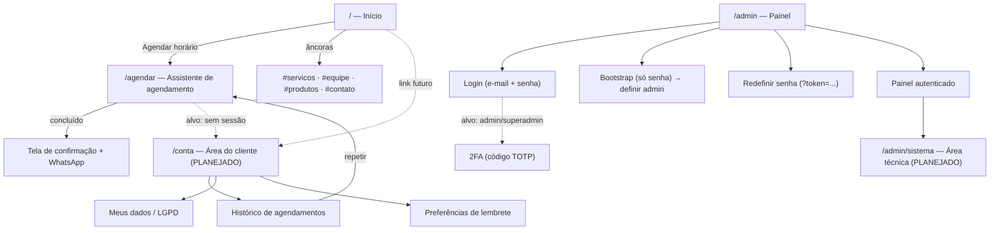

# 07 — Navegação e mapa de telas

Rotas reais em `src/app/`. O site tem duas rotas de página (`/` e `/agendar`);
o painel é uma rota só (`/admin`) com navegação interna entre seções. As áreas
`[PLANEJADO]` (conta do cliente, área técnica do superadmin) ainda não têm rota.

---

## 1. Mapa geral

---

## 2. Site público

### `/` — Início

Página única com seções e âncoras:

| Âncora      | Seção                 | Conteúdo                                                                |
| ----------- | --------------------- | ----------------------------------------------------------------------- |
| (topo)      | Capa                  | Nome, slogan, chamada para agendar.                                     |
| `#servicos` | Serviços              | Cartões de serviço (nome, duração, preço) — só ativos com profissional. |
| `#equipe`   | Equipe                | Profissionais ativos; "Equipe em montagem" quando não há.               |
| `#produtos` | Produtos              | Vitrine de produtos (aparece só se houver produto ativo).               |
| `#contato`  | Contato / localização | Endereço, horário, WhatsApp, Instagram.                                 |

O cabeçalho (`Header`) leva à `/agendar` e às âncoras.

### `/agendar` — Assistente de agendamento

Cinco passos lineares, com voltar entre eles (fluxo 1 de [04](04-fluxos-principais.md)):

`serviço → profissional → dia → horário → contato → resumo → confirmação`

Estados de tela: carregando, passo atual, "sem horários neste dia", erro de
concorrência (volta ao passo do horário), confirmação final com botão de
WhatsApp.

**Situação alvo (RN-50):** `/agendar` exige conta de cliente — visitante sem
sessão é levado a `/conta` (entrar ou cadastrar) e volta ao assistente; o passo
"contato" passa a só conferir os dados da conta.

---

## 3. Painel `/admin`

Uma página cliente (`PainelAdmin`) que alterna entre telas de acesso e o painel
autenticado com navegação lateral.

### Telas de acesso

| Estado                 | Quando                                                  | Campos                                           |
| ---------------------- | ------------------------------------------------------- | ------------------------------------------------ |
| **Login**              | `sessao` → `modoBootstrap: false`, sem sessão           | e-mail, senha; link "esqueci a senha"            |
| **2FA** `[PLANEJADO]`  | após e-mail + senha corretos, para `admin`/`superadmin` | código TOTP de 6 dígitos                         |
| **Esqueci a senha**    | a partir do login                                       | e-mail                                           |
| **Redefinir senha**    | URL `\/admin?token=...`                                 | nova senha, confirmação                          |
| **Bootstrap**          | `sessao` → `modoBootstrap: true`                        | só senha (a do ambiente)                         |
| **Concluir bootstrap** | logado em sessão de bootstrap                           | profissional ou nome, e-mail, senha, confirmação |

### Navegação lateral (seções)

Da definição em `PainelAdmin.jsx`:

| id              | Rótulo            | Tela            | RF principais                | Situação         |
| --------------- | ----------------- | --------------- | ---------------------------- | ---------------- |
| `visao`         | Visão geral       | `VisaoGeral`    | RF-60 a RF-66                | `[PARCIAL]`      |
| `agenda`        | Agenda            | `Agendamentos`  | RF-21 a RF-30                | `[PARCIAL]`      |
| `profissionais` | Profissionais     | `Profissionais` | RF-31 a RF-36                | `[PARCIAL]`      |
| `servicos`      | Serviços          | `Servicos`      | RF-37 a RF-41                | `[IMPLEMENTADO]` |
| `produtos`      | Produtos          | `Produtos`      | RF-42 a RF-46                | `[PARCIAL]`      |
| `horarios`      | Horários e folgas | `Horarios`      | RF-81 a RF-83, RF-34         | `[PARCIAL]`      |
| `financeiro`    | Financeiro        | `Financeiro`    | RF-53 a RF-59, RF-67 a RF-70 | `[PARCIAL]`      |
| `config`        | Configurações     | `Configuracoes` | RF-76 a RF-80                | `[IMPLEMENTADO]` |
| —               | Sair              | (logout)        | —                            | `[IMPLEMENTADO]` |

Comportamento comum: aviso de "alterações não salvas" ao trocar de seção com
edição pendente; o painel fica **travado em Configurações** enquanto a senha
inicial não for trocada.

### Seções `[PLANEJADO]` no painel

- **Comandas** — abertura/fechamento, itens de serviço e produto (RF-47 a RF-52).
- **Caixa** — abertura/fechamento do dia, entradas e saídas, formas de pagamento (RF-53 a RF-56).
- **Clientes** — ficha, histórico, métricas e bad-list (RF-71 a RF-75).
- **Relatórios** — filtros por período, profissional, serviço e forma de pagamento (RF-67 a RF-70).
- **Notificações** — fila de avisos do painel (RF-96).

---

## 4. Área do cliente `/conta` `[PLANEJADO]`

| Tela                 | Conteúdo                                                                   | RF                         |
| -------------------- | -------------------------------------------------------------------------- | -------------------------- |
| Entrar / criar conta | e-mail e senha; cadastro com nome, telefone, e-mail                        | RF-11 a RF-13              |
| Meus agendamentos    | histórico com status; ações cancelar/remarcar (corte de 30 min); "repetir" | RF-15, RF-16, RF-17, RF-10 |
| Meus dados           | ver/editar cadastro; exclusão de conta; uso de dados (LGPD)                | RF-14, RF-19, RF-20        |
| Lembretes            | escolher a antecedência do lembrete                                        | RF-18                      |

---

## 5. Área técnica do superadmin `[PLANEJADO]`

Rota separada do painel da barbearia (RN-42), acessível só com papel
`superadmin`. O administrador (dono) não a enxerga.

| Tela       | Conteúdo                                        | RF/UC |
| ---------- | ----------------------------------------------- | ----- |
| Migrations | versão do banco, migrations pendentes/aplicadas | UC-50 |
| Logs       | eventos estruturados recentes                   | UC-51 |
| Saúde      | resultado de `/api/health`, espaço em disco     | UC-51 |
| Backup     | status do backup e disparo de restauração       | UC-52 |
