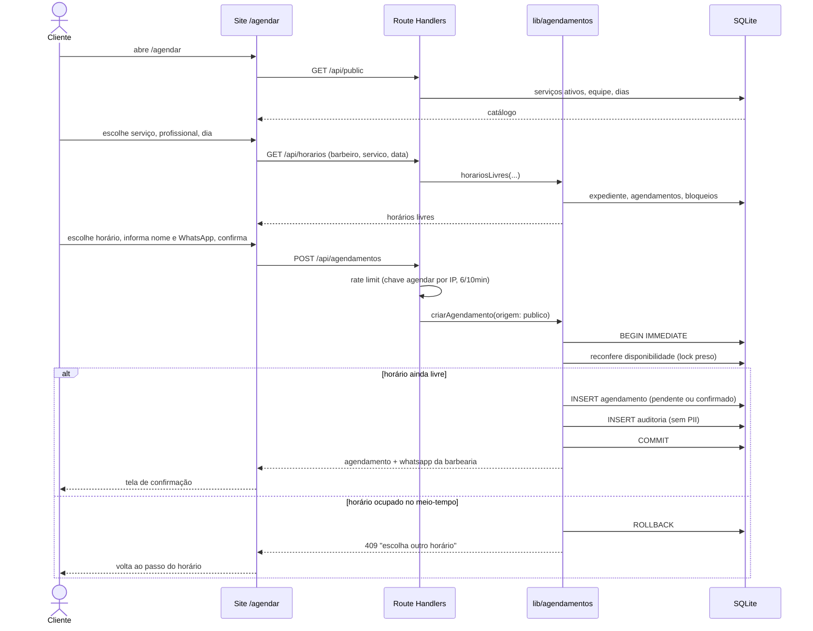
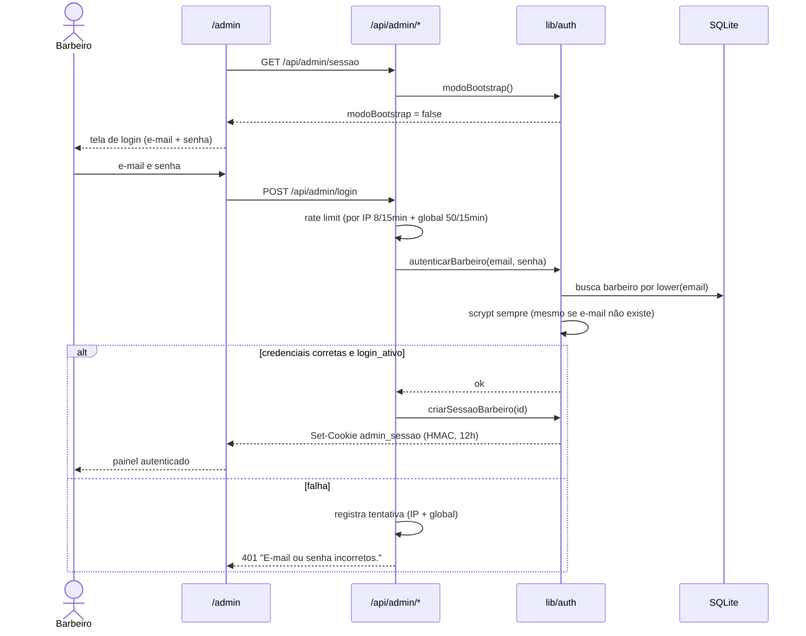
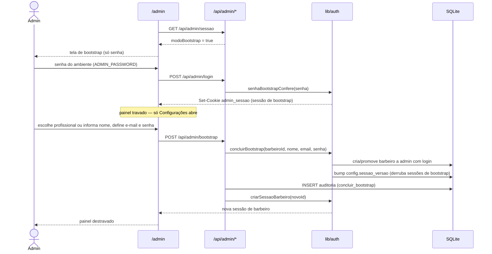
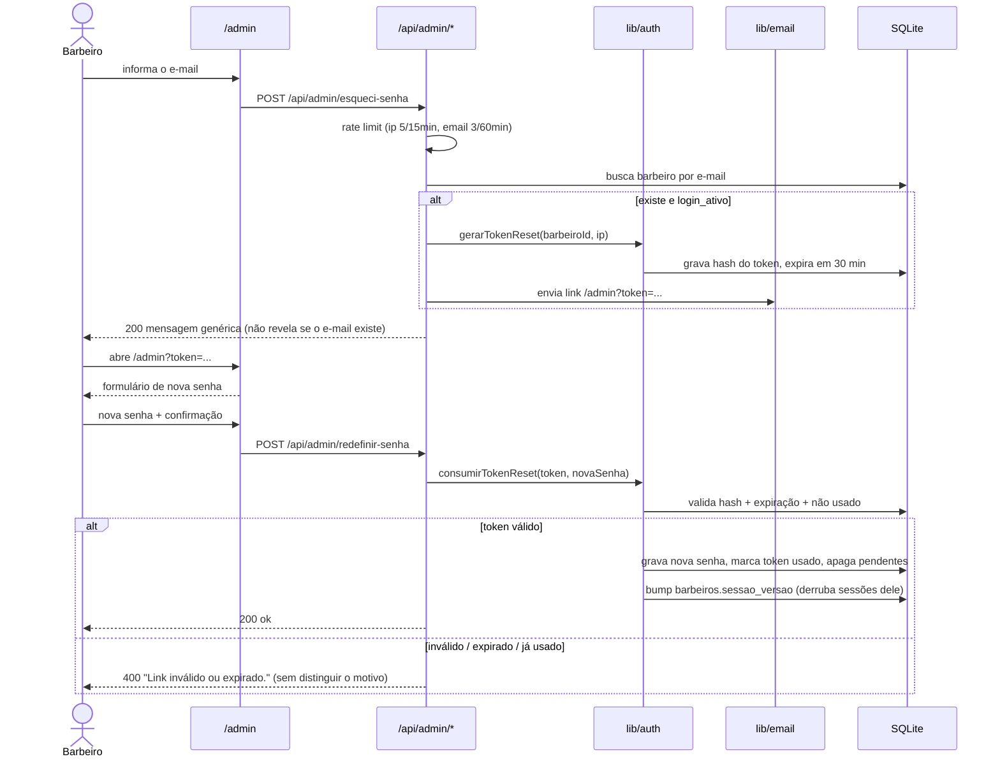
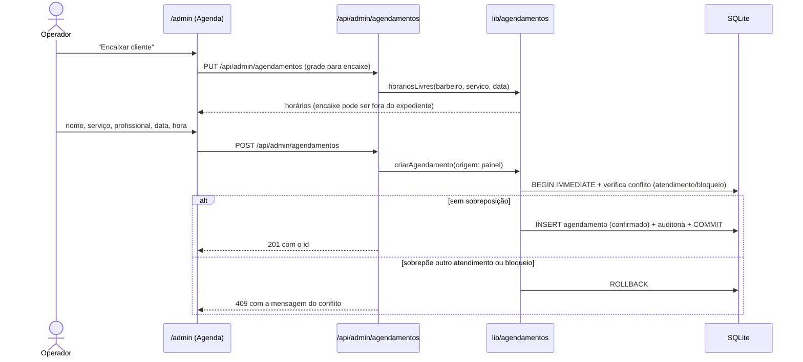

# 08 — Diagramas de sequência

Sequências dos processos principais. As `[IMPLEMENTADO]` refletem o código
atual (rotas em `src/app/api/**`, domínio em `src/lib/**`); as `[PLANEJADO]`
são a especificação a construir.

---

## 1. Agendamento `[IMPLEMENTADO]`

Hoje o cliente é anônimo. Na situação alvo (RN-50), o fluxo começa com login ou
cadastro e os dados de contato vêm da conta; o resto da sequência é o mesmo.



---

## 2. Login individual do barbeiro `[IMPLEMENTADO]`



---

## 3. Configuração inicial (bootstrap) `[IMPLEMENTADO]`



---

## 4. Recuperação de senha do painel `[IMPLEMENTADO]`



---

## 5. Encaixe de cliente pelo painel `[IMPLEMENTADO]`



---

## 6. Conclusão, comanda e caixa `[PLANEJADO]`

```mermaid
sequenceDiagram
    actor Barbeiro
    actor Caixa as Admin/Caixa
    participant Painel as /admin
    participant API as /api/admin/*
    participant DB as SQLite

    Caixa->>API: abre o caixa do dia (valor inicial)
    API->>DB: INSERT caixa_sessoes (aberto)

    Barbeiro->>Painel: abre comanda do agendamento
    Painel->>API: cria comanda (1:1 com o agendamento)
    API->>DB: INSERT comandas (aberta)
    Barbeiro->>Painel: adiciona serviços e produtos
    Painel->>API: adiciona itens
    alt produto com estoque suficiente
        API->>DB: INSERT comanda_itens; recalcula total
    else estoque insuficiente
        API-->>Painel: 409 "estoque insuficiente" (item não entra)
    end

    Barbeiro->>Painel: marca agendamento como concluido
    Painel->>API: PATCH /api/admin/agendamentos/[id] { status: concluido }
    API->>DB: UPDATE status (conta como comparecimento)

    Caixa->>Painel: fecha a comanda (uma ou mais formas de pagamento)
    Painel->>API: fecha comanda
    API->>API: exige agendamento vinculado em concluido
    API->>DB: INSERT pagamentos (1..N, uma linha por forma)
    API->>DB: INSERT caixa_movimentos (tipo = pagamento)
    API->>DB: UPDATE produtos SET estoque = estoque - qtd
    API->>DB: UPDATE comandas SET status = fechada

    Caixa->>API: fecha o caixa do dia (valor conferido)
    API->>DB: UPDATE caixa_sessoes (fechado, diferença)
```

A ordem é fixa: **concluir o agendamento → fechar a comanda → pagamento no
caixa** (RN-33). O item de produto é validado contra o estoque no momento de
entrar na comanda; o estoque nunca fica negativo (RN-34).

---

## 7. Rotinas periódicas: lembretes e no-show `[PLANEJADO]`

Acionadas por um **agendador externo** (cron do provedor de hospedagem ou
serviço de terceiros), que chama endpoints internos protegidos por segredo — o
processo Node não precisa ficar de pé para isso (RNF-22).

```mermaid
sequenceDiagram
    participant Sched as Agendador externo
    participant API as Endpoint interno protegido
    participant DB as SQLite
    participant Bot as WhatsApp e e-mail
    actor Cliente

    Sched->>API: POST /api/tarefas/marcar-no-show (segredo)
    API->>DB: confirmados cujo horário passou sem conclusão
    loop cada um
        API->>DB: UPDATE status = no-show (libera o horário)
        API->>DB: contador de faltas +1; bad-list se chegou a 3
    end

    Sched->>API: POST /api/tarefas/lembretes (segredo)
    API->>DB: confirmados cujo (horário - antecedência) caiu na janela
    loop cada agendamento
        API->>DB: revalida status = confirmado e lembrete não enviado
        alt ainda válido
            API->>Bot: envia lembrete por WhatsApp e e-mail
            Bot-->>Cliente: "seu horário é às HH:MM"
            API->>DB: marca lembrete como enviado
        else cancelado / remarcado / no-show
            API->>DB: ignora
        end
    end
```

---

## Decisões registradas

- **Sequência 6:** concluir o agendamento é pré-requisito para fechar a comanda;
  o item de produto sem estoque é bloqueado; a comanda aceita 1..N formas de
  pagamento.
- **Sequência 7:** as rotinas rodam por agendador externo chamando endpoints
  protegidos, não por processo Node contínuo; o `no-show` é automático; o
  lembrete vai por WhatsApp e e-mail, com o cliente escolhendo só a antecedência.
