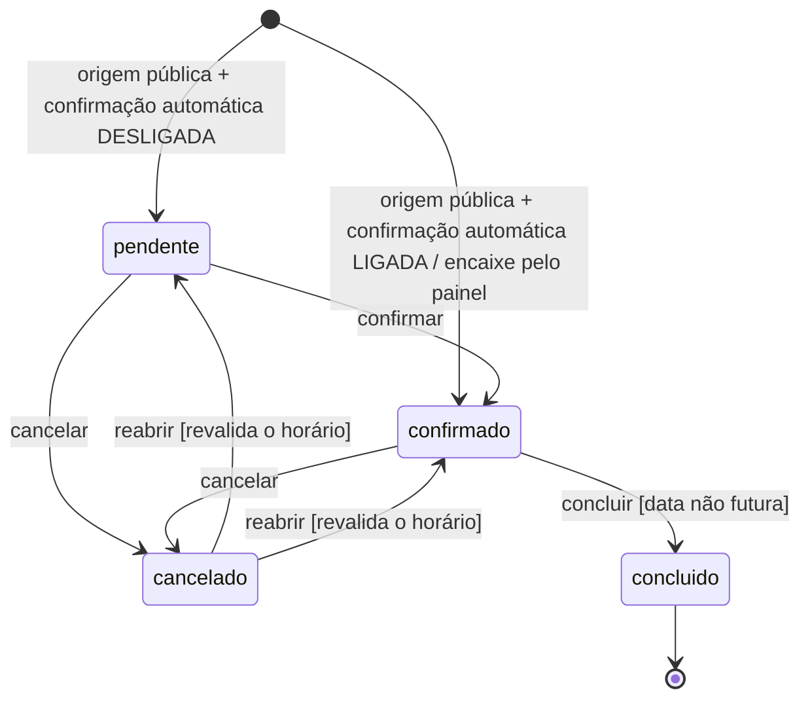
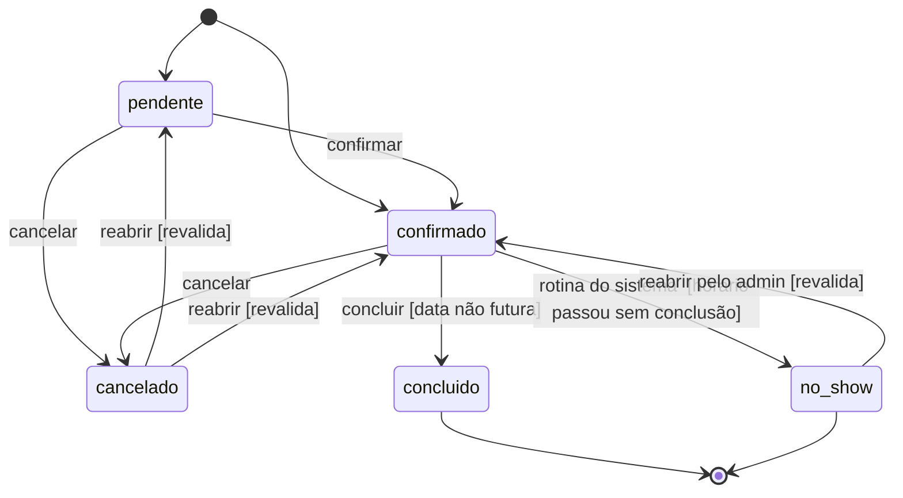

# 09 — Máquina de estados do agendamento

O `status` de um agendamento só muda por transições explicitamente permitidas.
A regra está em `TRANSICOES_LEGAIS`, em `src/lib/agendamentos.js`, e é aplicada
por `mudarStatusAgendamento()` — uma transição fora da lista devolve erro 400 e
não toca no banco. Coberta por `tests/estado-agendamento.test.js`.

O motivo de existir uma máquina de estados, e não um campo livre: sem ela, um
cliente cancela, o horário é reoferecido, outra pessoa marca, e o barbeiro
clica em "Confirmar" na linha do cancelado — dois agendamentos no mesmo
horário. As transições legais e a revalidação na reabertura fecham esse caso.

---

## 1. Situação atual `[IMPLEMENTADO]`

Quatro estados: `pendente`, `confirmado`, `concluido`, `cancelado`.

### Tabela de transições

| De           | Para         | Gatilho           | Guarda                                                                        | Origem no código                  |
| ------------ | ------------ | ----------------- | ----------------------------------------------------------------------------- | --------------------------------- |
| _(nenhum)_   | `pendente`   | criar agendamento | origem pública **e** `confirmacao_automatica <> "1"`                          | `criarAgendamento` (RN-21)        |
| _(nenhum)_   | `confirmado` | criar agendamento | origem pública com `confirmacao_automatica = "1"`, **ou** encaixe pelo painel | `criarAgendamento` (RN-21)        |
| `pendente`   | `confirmado` | confirmar         | —                                                                             | `TRANSICOES_LEGAIS`               |
| `pendente`   | `cancelado`  | cancelar          | —                                                                             | `TRANSICOES_LEGAIS`               |
| `confirmado` | `concluido`  | concluir          | `data` do agendamento **não** pode ser futura                                 | `mudarStatusAgendamento` (RN-19)  |
| `confirmado` | `cancelado`  | cancelar          | —                                                                             | `TRANSICOES_LEGAIS`               |
| `cancelado`  | `pendente`   | reabrir           | revalida disponibilidade do horário; falha se o slot já foi ocupado           | `mudarStatusAgendamento` (RN-20)  |
| `cancelado`  | `confirmado` | reabrir           | revalida disponibilidade do horário; falha se o slot já foi ocupado           | `mudarStatusAgendamento` (RN-20)  |
| `concluido`  | _(nenhuma)_  | —                 | estado final                                                                  | `TRANSICOES_LEGAIS` (lista vazia) |

### Transições recusadas (exemplos)

- `pendente → concluido` — precisa passar por `confirmado`.
- `concluido → qualquer` — estado final.
- `cancelado → concluido` — só volta para `pendente` ou `confirmado`.
- Reabrir um `cancelado` cujo horário já foi tomado por outro agendamento.

### `remarcar` (mudança de data/horário, não de status)

`remarcarAgendamento()` é uma operação à parte: muda `data`/`inicio`/`fim`
revalidando o horário, mas **não** altera o `status`. É bloqueada se o
agendamento estiver `concluido` ou `cancelado`.

### Exclusão é ortogonal ao status

"Excluir" um agendamento preenche `excluido_em` (_soft delete_, RN-29) e pode
partir de qualquer estado. Não é um estado da máquina: o `status` anterior
fica preservado na linha, que só some das telas e dos cálculos.

### Efeito colateral no índice de duplicidade

O índice único parcial `idx_ag_sem_duplicidade` ignora linhas com
`status = 'cancelado'`. Ou seja: cancelar **libera** o horário para uma nova
marcação; por isso a reabertura precisa revalidar (RN-20).

---

## 2. Situação alvo `[PLANEJADO]`

Acrescenta `no-show` (cliente não compareceu). Não há e não está previsto um
estado "em atendimento".

### Novas transições

| De           | Para         | Gatilho                           | Guarda                                                  | Regra |
| ------------ | ------------ | --------------------------------- | ------------------------------------------------------- | ----- |
| `confirmado` | `no-show`    | **automática** (rotina periódica) | o horário do agendamento passou e ele não foi concluído | RN-18 |
| `no-show`    | `confirmado` | reabrir pelo admin                | só ação do administrador; revalida o horário            | RN-18 |

A marcação de `no-show` é feita por uma rotina periódica (acionada por
agendador externo — RNF-22), não por um clique no painel. O admin só age para
**reverter** um `no-show` (cliente que compareceu e o registro ficou errado).

### Impacto de `no-show` em outras áreas

- **Disponibilidade:** `no-show` **libera o horário**. O cálculo de horários
  livres e o índice único parcial passam a ignorar `('cancelado', 'no-show')` —
  o atendimento não aconteceu, então o horário volta a ser reservável (RN-05,
  RN-09).
- **Bad-list:** cada `no-show` incrementa o contador de faltas do cliente; 3
  sem nenhuma conclusão no meio o incluem na bad-list — um cancelamento não
  interrompe a contagem (RN-24). Um `concluido` zera o contador e o retira
  (RN-25).
- **Financeiro:** `no-show` não entra em "recebido" nem em "a receber"; conta
  só nas métricas de falta (RF-62).
