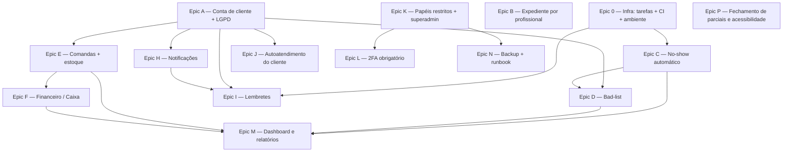

# 12 — Backlog de implementação

Backlog executável derivado dos documentos [01](01-requisitos-funcionais.md) a
[11](11-estrategia-de-testes.md). Reúne, em um só lugar, tudo que hoje está
`[PLANEJADO]` ou `[PARCIAL]` — para não ser mais preciso reabrir os documentos
para saber o que falta e em que ordem atacar.

O objetivo de cada _epic_ é **fechar** os itens marcados nos documentos: ao
concluir uma task, vira-se a tag do RF/RN afetado (de `[PLANEJADO]` para
`[PARCIAL]` ou `[IMPLEMENTADO]`), marca-se o _checkbox_ aqui e ajusta-se o
fluxo em [04](04-fluxos-principais.md) e a máquina de estados em
[09](09-maquina-de-estados.md) quando for o caso — tudo no mesmo commit
([11](11-estrategia-de-testes.md) §6). Os _slash commands_ de auditoria
(`.claude/commands/auditar-NN.md`, locais, fora do versionamento) conferem
depois se essa rotina foi seguida.

---

## Legenda

Cada task é uma linha de _checklist_ seguida de três rótulos:

- **Aceite:** critério verificável (teste, comando ou comportamento observável).
- **Satisfaz:** os RF/RN/UC que a task cumpre.
- **Reúso:** arquivos e símbolos a aproveitar, com `caminho:linha` quando ajuda.

Tamanho relativo por epic: **S** (dias), **M** (uma a duas semanas), **L**
(mais que isso). É estimativa grosseira para ordenar, não compromisso.

Nada neste backlog muda o comportamento ao ser lido — ele **descreve**
trabalho; quem o executa é que mexe no código.

---

## Correções ao mapa de reúso

Conferido contra o código em `src/`. Três ponteiros do plano original estavam
levemente fora — valem estas versões:

- **`iguais()` e `conferirHash()` em `src/lib/auth.js` são privados do
  módulo** (não exportados). Só `gerarHash()` é exportado. As tasks que
  reaproveitam comparação em tempo constante (T-0.1, T-L.3) precisam
  **exportar `iguais`** no mesmo commit, ou reimplementar com
  `crypto.timingSafeEqual` — o helper de 16 linhas está em
  [`src/lib/auth.js:78`](../src/lib/auth.js#L78).
- **`diasDisponiveis()` fica em `src/lib/slots.js:173`**, não em
  `datas-cliente.js`. O `datas-cliente.js` só tem `hojeLocal()` e
  `mesAtualLocal()` (utilidades de fuso para o navegador). O que roda no
  servidor e lê o expediente é o `slots.js`.
- **Drift de `EMAIL_PROVIDER`:** o código
  ([`src/lib/email.js:45`](../src/lib/email.js#L45)) e o `.env.example`
  reconhecem `console` (padrão) e `resend`; o
  [`config-ambiente.js:91`](../src/lib/config-ambiente.js#L91) já recusa o
  boot em produção se ficar em `console`. Os documentos
  [05](05-arquitetura.md) §2/§5 e [10](10-contrato-da-api.md) §4 ainda dizem
  "SMTP" — corrigir junto de T-H.6.

---

## Grafo de dependências entre os epics

**Ordem sugerida:** `0 → A → (B ∥ C ∥ K) → D → E → F → H → I → J → L → M → N → P`.

O Epic 0 e o Epic A destravam quase tudo: sem agendador externo protegido não
há no-show automático nem lembrete; sem conta de cliente não há comanda,
bad-list, notificação ao cliente nem autoatendimento. Atacar esses dois
primeiro.

---

## Epic 0 — Infra de tarefas agendadas, CI e validação de ambiente

**Tamanho:** S · **Depende de:** nada · **Documentos:**
[01](01-requisitos-funcionais.md) (RF-107, RNF-16, RNF-22),
[05](05-arquitetura.md) §5, [11](11-estrategia-de-testes.md) §5

Situação: `[PLANEJADO]`. Não existe nenhuma rota `/api/tarefas/*`, nenhum
segredo de tarefa e nenhum `.github/workflows/`.

- [ ] **T-0.1** `exigirSegredoTarefa(request)` — novo helper (em
      `src/lib/tarefas.js` ou `src/lib/auth.js`) que compara o header
      `X-Tarefa-Segredo` com `process.env.TAREFA_SEGREDO` em tempo constante.
      Devolve `null` quando confere, ou uma `Response` **401** quando não.
  - **Aceite:** teste unitário — segredo ausente, vazio ou errado responde
    401; segredo certo segue. A comparação não usa `===`.
  - **Satisfaz:** RF-107, RNF-22.
  - **Reúso:** `iguais` em [`src/lib/auth.js:78`](../src/lib/auth.js#L78)
    (exportar — ver "Correções ao mapa de reúso"); forma de rota
    (`export const dynamic` + `comLog`) de
    [`src/app/api/health/route.js`](../src/app/api/health/route.js).
- [ ] **T-0.2** Rotas `POST /api/tarefas/lembretes`,
      `POST /api/tarefas/marcar-no-show` e `POST /api/tarefas/limpeza` — por
      ora _stubs_ atrás de T-0.1, respondendo `{ ok: true, processados: 0 }`.
      A lógica real entra em T-C.3, T-I.3 e numa varredura de `limitador`.
  - **Aceite:** as três rotas respondem 401 sem o segredo e 200 com ele; não
    passam por `exigirSessao`.
  - **Satisfaz:** RF-107, [10](10-contrato-da-api.md) §5 (linha "Rotinas").
  - **Reúso:** [`src/app/api/health/route.js`](../src/app/api/health/route.js)
    como molde de rota pública mínima; `comLog` de `src/lib/log.js`.
- [ ] **T-0.3** `verificarAmbiente()` passa a exigir `TAREFA_SEGREDO` em
      produção (mais um bloco `problemas.push(...)`); o `.env.example`
      documenta a variável e como gerá-la.
  - **Aceite:** teste de `verificarAmbiente()` com `NODE_ENV=production` e sem
    `TAREFA_SEGREDO` retorna o problema na lista; com um valor real, não.
  - **Satisfaz:** RNF-22.
  - **Reúso:**
    [`src/lib/config-ambiente.js:59`](../src/lib/config-ambiente.js#L59)
    (padrão dos blocos `if`) e `ehPlaceholder` no mesmo arquivo.
- [ ] **T-0.4** `.github/workflows/ci.yml` — em cada _push_ e _pull request_:
      `npm ci`, `npm run format:check` e `npm test` no Node 22; _job_
      obrigatório para _merge_.
  - **Aceite:** o _workflow_ fica verde num PR de teste; uma quebra proposital
    de formatação ou de teste reprova o _job_.
  - **Satisfaz:** RNF-16, [11](11-estrategia-de-testes.md) §5.
  - **Reúso:** _scripts_ do [`package.json`](../package.json)
    (`format:check`, `test`); o `.nvmrc` fixa o Node 22.
- [ ] **T-0.5** `tests/tarefas.test.js` — cobre T-0.1 (401/200 pelo segredo) e
      os _stubs_. Vira `[PLANEJADO]` → `[PARCIAL]` em RF-107 e RNF-22 no
      [01](01-requisitos-funcionais.md) e ajusta
      [11](11-estrategia-de-testes.md) §5 (CI passa a existir).
  - **Aceite:** `npm test` continua verde; a contagem sobe e o número no
    [`README.md`](../README.md) e em [11](11-estrategia-de-testes.md) §1 é
    atualizado no mesmo commit.
  - **Satisfaz:** RNF-16, [11](11-estrategia-de-testes.md) §6.
  - **Reúso:** `bancoDeTeste()` de [`tests/ajuda.js:17`](../tests/ajuda.js#L17).

---

## Epic A — Conta de cliente e LGPD — CONCLUÍDO

**Tamanho:** L · **Depende de:** nada · **Documentos:**
[01](01-requisitos-funcionais.md) (Mód. 2 e 10),
[02](02-regras-de-negocio.md) (RN-50, RN-44, RN-45, RN-51),
[03](03-casos-de-uso.md) (UC-03, UC-04, UC-09, UC-32),
[06](06-modelo-de-dados.md) §3, [07](07-navegacao.md) §4,
[10](10-contrato-da-api.md) §5

Situação: **entregue** (migration 8). RF-05, RF-09, RF-11 a RF-14, RF-19,
RF-20, RF-72, RN-50, RN-44, RN-45, RN-51 e RNF-10 agora `[IMPLEMENTADO]`;
RF-71, RF-73, RF-74 e UC-32 `[PARCIAL]` (edição de cliente pelo admin e as
métricas de falta/bad-list ficam para os Epics C/D). Tabelas `clientes` e
`cliente_reset_tokens`; `src/lib/cliente-auth.js` (espelha `auth.js`);
rotas `/api/conta/*` (cadastro, login, logout, sessão, esqueci/redefinir
senha, perfil, `DELETE`); `POST /api/agendamentos` exige sessão de cliente
e grava `cliente_id`; página `/conta` (entrar/cadastrar + Meus dados +
LGPD); guarda de sessão em `/agendar`; seção "Clientes" no painel
(`GET /api/admin/clientes` e `.../[id]`). Decisões: telefone obrigatório no
cadastro; a exclusão anonimiza também os agendamentos.

**Fora do escopo entregue (fica para o epic dono):** histórico próprio do
cliente em `/conta` (RF-15 → Epic J); bad-list e faltas na ficha (RF-75 →
Epic D). Ver o apêndice I-1/I-3 para as inconsistências de contrato que
pegaram carona.

- [x] **T-A.1** Migration: tabela `clientes` (`id`, `nome`, `telefone`,
      `email TEXT NOT NULL`, `senha_hash TEXT NOT NULL DEFAULT ''`,
      `sessao_versao INTEGER NOT NULL DEFAULT 1`, `criado_em`,
      `anonimizado_em TEXT`) + índice único em `lower(email)` com
      `WHERE email <> ''`.
  - **Aceite:** `npm run migrate` sobe a versão; `bancoDeTeste()` cria a
    tabela; dois clientes com o mesmo e-mail em caixas diferentes violam o
    índice.
  - **Satisfaz:** RN-50, [06](06-modelo-de-dados.md) §3 (entidade `clientes`).
  - **Reúso:** índice `idx_barbeiros_email` em
    [`src/lib/migrations.js:342`](../src/lib/migrations.js#L342); a migration
    nova é só `conn.exec("CREATE TABLE ...")` (sem CHECK exótico — dispensa
    _rebuild_).
- [x] **T-A.2** Migration aditiva:
      `ALTER TABLE agendamentos ADD COLUMN cliente_id INTEGER REFERENCES clientes(id) ON DELETE SET NULL`.
  - **Aceite:** a coluna existe; agendamentos antigos ficam com `cliente_id`
    nulo; `npm test` continua verde.
  - **Satisfaz:** RN-50, RN-44, [06](06-modelo-de-dados.md) §3 ("Impacto em
    `agendamentos`").
  - **Reúso:** migration 5 (`ALTER TABLE ... ADD COLUMN` direto) em
    [`src/lib/migrations.js:291`](../src/lib/migrations.js#L291).
- [x] **T-A.3** `src/lib/cliente-auth.js` — espelha `src/lib/auth.js` para o
      cliente: cookie `cliente_sessao`, `construirTokenCliente`,
      `decodificarSessaoCliente`, `criarSessaoCliente`, `exigirSessaoCliente`,
      `cadastrarCliente`, `autenticarCliente` e os tokens de reset.
  - **Aceite:** `tests/cliente-auth.test.js` cobre assinatura HMAC,
    expiração, `sessao_versao`, `scrypt` sempre (mesmo e-mail inexistente) e
    token de reset de uso único.
  - **Satisfaz:** RF-11, RF-12, RF-13, UC-03, UC-04.
  - **Reúso:** [`src/lib/auth.js`](../src/lib/auth.js) inteiro como molde;
    `criarTokenReset` de [`src/lib/db.js:209`](../src/lib/db.js#L209).
- [x] **T-A.4** Helpers de acesso a `clientes` em `src/lib/db.js`:
      `buscarClientePorEmail`, `buscarClientePorId`, `criarCliente`,
      `atualizarCliente`, `anonimizarCliente` (zera os campos pessoais, grava
      `anonimizado_em` e **não** apaga agendamentos — o _snapshot_ de nome já
      os preserva).
  - **Aceite:** teste — depois de `anonimizarCliente`, o cliente some das
    buscas por e-mail mas os agendamentos dele seguem no banco com o
    `cliente_nome` congelado.
  - **Satisfaz:** RN-44, RN-45.
  - **Reúso:** helpers de barbeiro em
    [`src/lib/db.js:139`](../src/lib/db.js#L139).
- [x] **T-A.5** Rotas de conta: `POST /api/conta/cadastro`,
      `POST /api/conta/login`, `POST /api/conta/logout`,
      `GET /api/conta/sessao`, `POST /api/conta/esqueci-senha`,
      `POST /api/conta/redefinir-senha`, `GET`/`PATCH /api/conta/perfil` e
      `DELETE /api/conta`. Rate limit nas públicas (chaves
      `conta-login:<ip>` e `conta-esqueci:email:<hash>`).
  - **Aceite:** testes de integração — cadastro cria a conta; login emite
    cookie; `esqueci-senha` responde sempre a mesma frase; `DELETE /api/conta`
    anonimiza; sem sessão, `PATCH /api/conta/perfil` responde 401.
  - **Satisfaz:** RF-11 a RF-14, RF-19, RF-20; UC-03, UC-04, UC-09; RN-44,
    RN-45.
  - **Reúso:** rotas equivalentes do painel em
    [`src/app/api/admin/`](../src/app/api/admin/) (`login`, `esqueci-senha`,
    `redefinir-senha`, `perfil`); `lerCorpoJson` de `src/lib/requisicao.js`;
    `limiteAtingido`/`registrarTentativa` de
    [`src/lib/limitador.js:51`](../src/lib/limitador.js#L51).
- [x] **T-A.6** `POST /api/agendamentos` passa a exigir `exigirSessaoCliente`;
      `cliente_nome`/`cliente_telefone` viram _snapshot_ vindo da conta e o
      `cliente_id` é gravado. O agendamento anônimo deixa de existir.
  - **Aceite:** `POST /api/agendamentos` sem cookie de cliente responde 401;
    com sessão, grava `cliente_id` e ignora nome/telefone do corpo;
    `tests/agendamentos.test.js` é atualizado.
  - **Satisfaz:** RN-50, RF-05, RF-09.
  - **Reúso:** `criarAgendamento` em
    [`src/lib/agendamentos.js:113`](../src/lib/agendamentos.js#L113).
- [x] **T-A.7** `src/app/conta/page.jsx` + `AreaCliente.jsx`:
      entrar/cadastrar e "Meus dados" (editar cadastro, excluir conta, texto
      de uso de dados — LGPD).
  - **Aceite:** fluxo manual — criar conta, entrar, editar telefone, pedir
    exclusão; a tela mostra a base legal e o prazo de retenção.
  - **Satisfaz:** RF-11 a RF-14, RF-19, RF-20; [07](07-navegacao.md) §4.
  - **Reúso:** forma de
    [`src/components/admin/Servicos.jsx`](../src/components/admin/Servicos.jsx);
    `CampoEmail`/`CampoSenha` de
    [`src/app/admin/PainelAdmin.jsx:96`](../src/app/admin/PainelAdmin.jsx#L96);
    `Modal` de
    [`src/components/admin/base.jsx:33`](../src/components/admin/base.jsx#L33).
- [x] **T-A.8** `FluxoAgendamento.jsx` / `src/app/agendar/page.jsx`: guarda de
      sessão — visitante sem conta vai para `/conta?retorno=/agendar`; o passo
      "Seus dados" vira revisão _read-only_ dos dados da conta, com o resumo
      completo antes de confirmar.
  - **Aceite:** sem sessão, `/agendar` leva a `/conta` e volta ao assistente
    depois do login; o passo de contato não tem mais campos editáveis.
  - **Satisfaz:** RF-05, RF-06, RF-09; [07](07-navegacao.md) §2.
  - **Reúso:** `hojeLocal`/`mesAtualLocal` de `src/lib/datas-cliente.js`;
    wizard atual em
    [`src/app/agendar/FluxoAgendamento.jsx`](../src/app/agendar/FluxoAgendamento.jsx).
- [x] **T-A.9** Seção "Clientes" no painel:
      `src/components/admin/Clientes.jsx` + entrada em `SECOES` + ícone;
      `GET /api/admin/clientes` e `GET /api/admin/clientes/[id]` (ficha,
      histórico, classificação novo/recorrente derivada — RN-51).
  - **Aceite:** a seção lista clientes com busca; a ficha mostra histórico,
    contagem de faltas e situação da bad-list; as duas rotas respondem 401 sem
    sessão e estão em `ROTAS_PROTEGIDAS`.
  - **Satisfaz:** RF-71, RF-72, RF-73, RF-74, RF-75, RN-51, UC-32.
  - **Reúso:** `SECOES` em
    [`src/app/admin/PainelAdmin.jsx:31`](../src/app/admin/PainelAdmin.jsx#L31);
    `ROTAS_PROTEGIDAS` em
    [`tests/autorizacao.test.js:20`](../tests/autorizacao.test.js#L20);
    `Equipe`/`Pessoa` em
    [`src/components/Icones.jsx`](../src/components/Icones.jsx).
- [x] **T-A.10** Testes: `tests/cliente-auth.test.js`, integração de
      `/api/conta/*` e de `/api/agendamentos` com _gate_ de sessão. Vira as
      tags em [01](01-requisitos-funcionais.md) (Mód. 2, RF-05, RF-09),
      [02](02-regras-de-negocio.md) (RN-50, RN-44, RN-45),
      [03](03-casos-de-uso.md), [06](06-modelo-de-dados.md),
      [07](07-navegacao.md) e [10](10-contrato-da-api.md).
  - **Aceite:** `npm test` verde; RNF-10 sobe de `[PARCIAL]` para
    `[IMPLEMENTADO]`.
  - **Satisfaz:** [11](11-estrategia-de-testes.md) §6.
  - **Reúso:** `criarBarbeiroComLogin` como molde de fábrica de conta em
    [`tests/ajuda.js:90`](../tests/ajuda.js#L90).

---

## Epic B — Expediente por profissional — CONCLUÍDO

**Tamanho:** M · **Depende de:** nada · **Documentos:**
[01](01-requisitos-funcionais.md) (RF-34, RF-81),
[02](02-regras-de-negocio.md) (RN-14, RN-49), [05](05-arquitetura.md) §6,
[06](06-modelo-de-dados.md) §3

Situação: **entregue** (migration 7). RF-34, RF-81, RN-14 e RN-49 agora
`[IMPLEMENTADO]`. O expediente é individual por profissional
(`expediente_barbeiro`), com folgas recorrentes (`folgas_recorrentes`); a
tabela global `expediente` foi removida. Profissional novo nasce com o
expediente padrão via _trigger_. O "Horário de funcionamento" do site é a
união dos profissionais ativos. Endpoint novo:
`GET`/`PUT /api/admin/barbeiros/[id]/expediente`; `GET /api/public` aceita
`?barbeiro=<id>`.

- [x] **T-B.1** Migration: `expediente_barbeiro` (`barbeiro_id` FK
      `ON DELETE CASCADE`, `dia` com `CHECK 0..6`, `aberto`, `abre`, `fecha`,
      PK `(barbeiro_id, dia)`) + `folgas_recorrentes` (`id`, `barbeiro_id` FK
      `CASCADE`, `dia_semana` com `CHECK 0..6`, `criado_em`). Semear
      `expediente_barbeiro` a partir da grade global para cada barbeiro
      existente; ao final, `DROP TABLE expediente`.
  - **Aceite:** depois da migration, cada barbeiro tem 7 linhas de expediente
    iguais à grade antiga; `expediente` não existe mais; `npm test` verde com
    `tests/slots.test.js` ajustado.
  - **Satisfaz:** RN-14, RN-49, [06](06-modelo-de-dados.md) §3 ("Substituição
    de `expediente`").
  - **Reúso:** _rebuild_ da migration 3 em
    [`src/lib/migrations.js:167`](../src/lib/migrations.js#L167) (criar a nova,
    `INSERT..SELECT`, `DROP`, `RENAME` sempre a nova); `GLOB_HORA` no topo do
    arquivo para os CHECK de `HH:MM`.
- [x] **T-B.2** `src/lib/db.js`: `lerExpedienteBarbeiro`,
      `salvarExpedienteBarbeiro`, `listarFolgasRecorrentes`,
      `definirFolgasRecorrentes`.
  - **Aceite:** teste — salvar e reler o expediente de um barbeiro; definir
    uma folga recorrente às segundas.
  - **Satisfaz:** RN-14, RN-49.
  - **Reúso:** `lerExpediente`/`salvarExpediente` em
    [`src/lib/db.js:67`](../src/lib/db.js#L67) (mesma forma, com `barbeiro_id`
    a mais).
- [x] **T-B.3** `src/lib/slots.js`: `horariosLivres` e `diasDisponiveis`
      passam a ler o expediente **do barbeiro**; folga recorrente do barbeiro
      conta como dia fechado.
  - **Aceite:** `tests/slots.test.js` estendido — dois barbeiros com
    expedientes diferentes no mesmo dia oferecem horários diferentes; barbeiro
    de folga recorrente na segunda não oferece nada na segunda.
  - **Satisfaz:** RN-14, RN-49, [05](05-arquitetura.md) §6.
  - **Reúso:** `horariosLivres` em
    [`src/lib/slots.js:112`](../src/lib/slots.js#L112) e `diasDisponiveis` em
    [`src/lib/slots.js:173`](../src/lib/slots.js#L173) (hoje leem
    `SELECT * FROM expediente`).
- [x] **T-B.4** `GET /api/public` e `GET /api/horarios`: `diasDisponiveis`
      passa a depender do barbeiro (o assistente já sabe o barbeiro no passo
      da data). Ajustar `FluxoAgendamento.jsx` para buscar os dias depois de
      escolhido o profissional.
  - **Aceite:** no assistente, trocar o profissional recalcula os dias e
    horários disponíveis.
  - **Satisfaz:** RF-03, RF-04 (comportamento por profissional).
  - **Reúso:** [`src/app/api/public/route.js`](../src/app/api/public/route.js)
    e [`src/app/api/horarios/route.js`](../src/app/api/horarios/route.js).
- [x] **T-B.5** Painel: editor de expediente **por profissional** e de folgas
      recorrentes em `Horarios.jsx` (e/ou um bloco em `Configuracoes.jsx`); a
      grade global some da interface.
  - **Aceite:** dá para abrir/fechar um dia e mudar `abre`/`fecha` de cada
    profissional; a validação `fecha > abre` continua valendo.
  - **Satisfaz:** RF-34, RF-81.
  - **Reúso:** `validarExpediente` em
    [`src/lib/validacao.js:160`](../src/lib/validacao.js#L160);
    [`src/components/admin/Horarios.jsx`](../src/components/admin/Horarios.jsx).
- [x] **T-B.6** `tests/expediente-barbeiro.test.js`. Vira as tags de RF-34,
      RF-81, RN-14, RN-49 e ajusta [05](05-arquitetura.md) §6 e
      [06](06-modelo-de-dados.md) §1/§3 (a `expediente` sai do DER atual).
  - **Aceite:** `npm test` verde.
  - **Satisfaz:** [11](11-estrategia-de-testes.md) §6.

---

## Epic C — No-show automático e máquina de estados alvo

**Tamanho:** M · **Depende de:** Epic 0 · **Documentos:**
[01](01-requisitos-funcionais.md) (RF-25, RF-62),
[02](02-regras-de-negocio.md) (RN-16, RN-18), [06](06-modelo-de-dados.md),
[09](09-maquina-de-estados.md) §2

Situação: `[PLANEJADO]`. O `status` só aceita quatro valores; não há rotina de
marcação.

- [ ] **T-C.1** Migration (_rebuild_ de `agendamentos`): o `CHECK` de `status`
      passa a incluir `'no-show'`; recriar `idx_ag_data` e `idx_ag_barbeiro`;
      o índice único parcial vira
      `... WHERE status NOT IN ('cancelado', 'no-show')`.
  - **Aceite:** inserir um agendamento `no-show` no mesmo slot de um
    `cancelado` não viola o índice; `npm test` verde.
  - **Satisfaz:** RN-16, RN-18, RN-09, [09](09-maquina-de-estados.md) §2
    ("Impacto de `no-show`").
  - **Reúso:** _rebuild_ da migration 3
    ([`src/lib/migrations.js:167`](../src/lib/migrations.js#L167)) e o índice
    da migration 4
    ([`src/lib/migrations.js:277`](../src/lib/migrations.js#L277)).
- [ ] **T-C.2** `src/lib/agendamentos.js`: `TRANSICOES_LEGAIS` ganha
      `confirmado → no-show` e `no-show → confirmado` (reversão do admin,
      revalidando o horário); `verificarConflito` e a query de
      `horariosLivres` passam a ignorar `no-show` além de `cancelado`.
  - **Aceite:** `tests/estado-agendamento.test.js` estendido — a transição
    `confirmado → no-show` é legal, `pendente → no-show` é ilegal,
    `no-show → confirmado` revalida e falha se o slot foi tomado; slot de
    `no-show` volta a aparecer em `horariosLivres`.
  - **Satisfaz:** RN-16, RN-18, RN-05.
  - **Reúso:** `TRANSICOES_LEGAIS` em
    [`src/lib/agendamentos.js:365`](../src/lib/agendamentos.js#L365);
    `verificarConflito` em
    [`src/lib/agendamentos.js:51`](../src/lib/agendamentos.js#L51); query de
    slots em [`src/lib/slots.js:130`](../src/lib/slots.js#L130).
- [ ] **T-C.3** `POST /api/tarefas/marcar-no-show` (era _stub_ no Epic 0):
      varre `confirmado` cujo fim já passou (no fuso da barbearia) e chama
      `mudarStatusAgendamento(id, "no-show")` para cada um; devolve
      `{ ok: true, processados: n }`.
  - **Aceite:** `tests/tarefas.test.js` — dado um `confirmado` de ontem, a
    chamada com o segredo marca `no-show` e libera o slot; um `confirmado`
    futuro não é tocado.
  - **Satisfaz:** RF-25, RF-107, [08](08-diagramas-de-sequencia.md) §7.
  - **Reúso:** `mudarStatusAgendamento` em
    [`src/lib/agendamentos.js:380`](../src/lib/agendamentos.js#L380);
    `agora()` em [`src/lib/slots.js:19`](../src/lib/slots.js#L19).
- [ ] **T-C.4** Painel `Agendamentos.jsx`: `no-show` no filtro `STATUS`, na
      cópia local de `TRANSICOES_LEGAIS`, em `Etiqueta` (+ classe CSS
      `etiqueta-no-show` no `globals.css`); botão "Reverter falta" nas linhas
      `no-show`.
  - **Aceite:** a lista filtra por "Faltas"; a etiqueta aparece; o botão só
    aparece em `no-show` e faz `PATCH` com `{ status: "confirmado" }`.
  - **Satisfaz:** RF-25, RF-29.
  - **Reúso:** `STATUS` em
    [`src/components/admin/Agendamentos.jsx:23`](../src/components/admin/Agendamentos.jsx#L23);
    `TRANSICOES_LEGAIS` (cópia) em
    [`src/components/admin/Agendamentos.jsx:33`](../src/components/admin/Agendamentos.jsx#L33);
    `Etiqueta` em
    [`src/components/admin/base.jsx:171`](../src/components/admin/base.jsx#L171).
- [ ] **T-C.5** Testes de estado + varredura + exclusão de slot. Vira as tags
      no [09](09-maquina-de-estados.md) (situação alvo → atual), RF-25, RF-62,
      RN-16, RN-18, e o fluxo 7 de [04](04-fluxos-principais.md).
  - **Aceite:** `npm test` verde.
  - **Satisfaz:** [11](11-estrategia-de-testes.md) §6.

---

## Epic D — Bad-list (controle de faltas)

**Tamanho:** S · **Depende de:** Epic A + Epic C · **Documentos:**
[01](01-requisitos-funcionais.md) (Mód. 14),
[02](02-regras-de-negocio.md) (RN-23 a RN-26),
[04](04-fluxos-principais.md) §7

Situação: `[PLANEJADO]`.

- [ ] **T-D.1** Migration: `bad_list` (`cliente_id` PK
      `REFERENCES clientes(id) ON DELETE CASCADE`,
      `faltas_consecutivas INTEGER NOT NULL DEFAULT 0`, `incluido_em TEXT`).
  - **Aceite:** a tabela existe; `npm run migrate` sobe a versão.
  - **Satisfaz:** RN-23, RN-24, [06](06-modelo-de-dados.md) §3.
  - **Reúso:** forma das migrations aditivas em `src/lib/migrations.js`.
- [ ] **T-D.2** `src/lib/agendamentos.js` — dentro da transação de
      `mudarStatusAgendamento`: a transição para `no-show` incrementa
      `faltas_consecutivas` (ao chegar a 3, grava `incluido_em`); a transição
      para `concluido` zera o contador e limpa `incluido_em`; a transição para
      `cancelado` não mexe.
  - **Aceite:** teste do exemplo da RN-24 — 2 `no-show`, depois `cancelado`,
    depois `no-show` = 3 faltas, entra na bad-list; um `concluido` depois zera
    e retira.
  - **Satisfaz:** RN-23, RN-24, RN-25, RF-98, RF-99, RF-100.
  - **Reúso:** transação de `mudarStatusAgendamento` em
    [`src/lib/agendamentos.js:402`](../src/lib/agendamentos.js#L402);
    `registrarAuditoria` de `src/lib/auditoria.js` (na mesma transação).
- [ ] **T-D.3** `src/lib/db.js` `situacaoBadList(clienteId)`; selo na linha de
      `Agendamentos.jsx` e na ficha de `Clientes.jsx`.
  - **Aceite:** cliente na bad-list mostra o selo; a lista de agendamentos e a
    ficha do cliente concordam; nada bloqueia agendamento nem notifica o
    cliente (RN-26).
  - **Satisfaz:** RF-101, RN-26.
  - **Reúso:** `Etiqueta` de `src/components/admin/base.jsx`; ficha de T-A.9.
- [ ] **T-D.4** `tests/bad-list.test.js` (o cenário da RN-24). Vira as tags de
      RF-98 a RF-101 e RN-23 a RN-26, e o fluxo 7 de
      [04](04-fluxos-principais.md).
  - **Aceite:** `npm test` verde.
  - **Satisfaz:** [11](11-estrategia-de-testes.md) §6.

---

## Epic E — Comandas e estoque de produtos

**Tamanho:** L · **Depende de:** Epic A · **Documentos:**
[01](01-requisitos-funcionais.md) (Mód. 6 e 7),
[02](02-regras-de-negocio.md) (RN-33, RN-34), [03](03-casos-de-uso.md) (UC-31),
[06](06-modelo-de-dados.md), [08](08-diagramas-de-sequencia.md) §6

Situação: RF-43 é `[PARCIAL]` (a coluna `estoque` existe, editável à mão); o
resto do módulo é `[PLANEJADO]`.

- [ ] **T-E.1** Migration: `comandas` (`id`, `cliente_id` FK `SET NULL`,
      `agendamento_id` FK `SET NULL`, `status` com
      `CHECK ('aberta','fechada')`, `total_centavos` com `CHECK >= 0`,
      `criado_em`, `fechada_em TEXT`) + `comanda_itens` (`id`, `comanda_id` FK
      `CASCADE`, `tipo` com `CHECK ('servico','produto')`, `servico_id` FK
      `SET NULL`, `produto_id` FK `SET NULL`, `quantidade` com `CHECK > 0`,
      `preco_unit_centavos` com `CHECK >= 0`).
  - **Aceite:** as tabelas existem; `npm run migrate` sobe a versão.
  - **Satisfaz:** RN-33, [06](06-modelo-de-dados.md) §3.
  - **Reúso:** CHECK com `_centavos >= 0` como em `servicos`/`produtos`
    ([`src/lib/migrations.js:190`](../src/lib/migrations.js#L190)).
- [ ] **T-E.2** `src/lib/comandas.js`: `abrirComanda`, `adicionarItem` (valida
      estoque para `produto` — lança `ErroComanda` se insuficiente, RN-34),
      `recalcularTotal`, `fecharComanda` (`.immediate()`: exige o agendamento
      vinculado em `concluido` — RN-33; grava 1..N `pagamentos` cuja soma bate
      o total — RN-30; grava `caixa_movimentos` do tipo `pagamento`;
      decrementa `produtos.estoque` sem negativar; auditoria).
  - **Aceite:** `tests/comandas.test.js` — não fecha com agendamento fora de
    `concluido`; item de produto sem estoque é recusado; soma dos pagamentos
    diferente do total é recusada; ao fechar, o estoque cai e nunca fica
    negativo.
  - **Satisfaz:** RN-30, RN-33, RN-34, RF-50, RF-51, UC-31.
  - **Reúso:** `src/lib/agendamentos.js` como molde de módulo de domínio
    (`conn.transaction(fn).immediate()`, `class ErroX extends Error`,
    `tratarErroTransacao` em
    [`src/lib/agendamentos.js:27`](../src/lib/agendamentos.js#L27),
    `registrarAuditoria`).
- [ ] **T-E.3** Rotas `GET`/`POST /api/admin/comandas`,
      `POST /api/admin/comandas/[id]/itens`,
      `POST /api/admin/comandas/[id]/fechar`. Registrar em `ROTAS_PROTEGIDAS`
      (e o teste de cobertura de `autorizacao.test.js`).
  - **Aceite:** cada método+rota responde 401 sem sessão; o teste "toda rota
    sob /api/admin/\* está coberta" continua verde.
  - **Satisfaz:** RF-47, RF-48, RF-49, RF-50, RF-51,
    [10](10-contrato-da-api.md) §5.
  - **Reúso:** `ROTAS_PROTEGIDAS` em
    [`tests/autorizacao.test.js:20`](../tests/autorizacao.test.js#L20); forma
    de rota de
    [`src/app/api/admin/agendamentos/[id]/route.js`](../src/app/api/admin/agendamentos/[id]/route.js).
- [ ] **T-E.4** Painel `Comandas.jsx` + entrada em `SECOES` + ícone novo
      (recibo/nota) em `Icones.jsx`; ação "Abrir comanda" nas linhas de
      `Agendamentos.jsx` de agendamentos `concluido`.
  - **Aceite:** dá para abrir uma comanda a partir de um agendamento
    concluído, adicionar serviço/produto, ver o total e fechar com uma ou mais
    formas de pagamento.
  - **Satisfaz:** RF-47, RF-48, RF-49, RF-50, RF-51, RF-52.
  - **Reúso:** `SECOES` em
    [`src/app/admin/PainelAdmin.jsx:31`](../src/app/admin/PainelAdmin.jsx#L31);
    o `Icones.jsx` não tem "Recibo" — criar (nenhum ícone atual serve).
- [ ] **T-E.5** `Produtos.jsx`: histórico de movimentação derivado de
      `comanda_itens`; a coluna `estoque` deixa de ser só manual.
  - **Aceite:** vender um produto por uma comanda aparece no histórico do
    produto e baixa o estoque.
  - **Satisfaz:** RF-43, RF-44, RF-45, RF-46.
  - **Reúso:**
    [`src/components/admin/Produtos.jsx`](../src/components/admin/Produtos.jsx).
- [ ] **T-E.6** `tests/comandas.test.js`. Vira as tags de RF-43 a RF-52,
      RN-33, RN-34, UC-31 e a sequência 6 de
      [08](08-diagramas-de-sequencia.md).
  - **Aceite:** `npm test` verde.
  - **Satisfaz:** [11](11-estrategia-de-testes.md) §6.

---

## Epic F — Financeiro e caixa

**Tamanho:** L · **Depende de:** Epic E · **Documentos:**
[01](01-requisitos-funcionais.md) (Mód. 8),
[02](02-regras-de-negocio.md) (RN-30 a RN-32),
[03](03-casos-de-uso.md) (UC-29, UC-30), [04](04-fluxos-principais.md) §5,
[08](08-diagramas-de-sequencia.md) §6

Situação: RF-57, RF-58 e RF-70 são `[PARCIAL]`; o caixa em si é `[PLANEJADO]`.

- [ ] **T-F.1** Migration: `formas_pagamento` (`id`, `nome`, `ativo`,
      `ordem`); `caixa_sessoes` (`id`, `data`, `aberto_em`, `fechado_em TEXT`,
      `valor_abertura_centavos`, `valor_fechamento_centavos`,
      `diferenca_centavos`); `caixa_movimentos` (`id`, `caixa_sessao_id` FK
      `CASCADE`, `valor_centavos`, `tipo` com
      `CHECK ('sangria','reforco','troco','entrada_avulsa','saida_avulsa','pagamento')`,
      `descricao`, `pagamento_id` FK `SET NULL`, `criado_em`); `pagamentos`
      (`id`, `comanda_id` FK `CASCADE`, `forma_pagamento_id` FK `SET NULL`,
      `valor_centavos` com `CHECK >= 0`, `barbeiro_id` FK `SET NULL`,
      `registrado_em`).
  - **Aceite:** as quatro tabelas existem; `npm run migrate` sobe a versão.
  - **Satisfaz:** RN-30, RN-31, RN-32, [06](06-modelo-de-dados.md) §3.
  - **Reúso:** forma das migrations em `src/lib/migrations.js`.
- [ ] **T-F.2** `formas_pagamento` como cadastro genérico do painel: entrada
      em `RECURSOS` (`{ tabela, colunas, numericas, ordem }`), _schema_ em
      `ESQUEMAS`, tela copiada de `Servicos.jsx` (ou bloco em
      `Configuracoes.jsx`), entrada em `SECOES`, ícone, e a variante
      `params: { recurso: "formas_pagamento" }` nos testes de
      `autorizacao.test.js`.
  - **Aceite:** dá para cadastrar/editar/desativar uma forma de pagamento pelo
    painel, sem escrever um _route file_ novo; `npm test` verde.
  - **Satisfaz:** RF-54.
  - **Reúso:** `RECURSOS` em
    [`src/app/api/admin/[recurso]/route.js:19`](../src/app/api/admin/[recurso]/route.js#L19);
    `ESQUEMAS` em [`src/lib/validacao.js:60`](../src/lib/validacao.js#L60);
    [`src/components/admin/Servicos.jsx`](../src/components/admin/Servicos.jsx).
- [ ] **T-F.3** `src/lib/caixa.js`: `abrirCaixa`, `fecharCaixa` (calcula a
      diferença), `registrarMovimento`, `caixaAbertoDoDia`.
  - **Aceite:** `tests/caixa.test.js` — não abre dois caixas no mesmo dia; o
    fechamento apura esperado × conferido e grava a diferença.
  - **Satisfaz:** RN-31, RF-55, RF-56, UC-29.
  - **Reúso:** `src/lib/agendamentos.js` como molde de módulo de domínio.
- [ ] **T-F.4** Rotas `POST /api/admin/caixa/abrir`,
      `POST /api/admin/caixa/fechar`, `GET`/`POST /api/admin/caixa/movimentos`.
      Registrar em `ROTAS_PROTEGIDAS`.
  - **Aceite:** 401 sem sessão nas quatro; teste de cobertura verde.
  - **Satisfaz:** RF-55, RF-56, [10](10-contrato-da-api.md) §5.
  - **Reúso:** `ROTAS_PROTEGIDAS` em `tests/autorizacao.test.js:20`.
- [ ] **T-F.5** Painel `Caixa.jsx` + `SECOES` + ícone `Dinheiro` (já existe);
      coluna "Pagamento" na linha de `Agendamentos.jsx` (`join` no _route_ da
      lista — RF-29); "recebido por profissional" em `Financeiro.jsx` a partir
      de `pagamentos.barbeiro_id`.
  - **Aceite:** a agenda mostra a forma de pagamento por linha; o Financeiro
    soma por profissional pelo pagamento, não pelo agendamento.
  - **Satisfaz:** RF-29, RF-53, RF-57, RF-58, RF-59.
  - **Reúso:** `Dinheiro` em
    [`src/components/Icones.jsx:148`](../src/components/Icones.jsx#L148);
    [`src/components/admin/Financeiro.jsx`](../src/components/admin/Financeiro.jsx).
- [ ] **T-F.6** `tests/caixa.test.js`. Vira as tags de RF-53 a RF-59, RN-30 a
      RN-32, UC-29, UC-30, o fluxo 5 de [04](04-fluxos-principais.md) e a
      sequência 6 de [08](08-diagramas-de-sequencia.md).
  - **Aceite:** `npm test` verde.
  - **Satisfaz:** [11](11-estrategia-de-testes.md) §6.

---

## Epic H — Notificações (WhatsApp Cloud API, e-mail ao cliente e painel)

**Tamanho:** M · **Depende de:** Epic A · **Documentos:**
[01](01-requisitos-funcionais.md) (Mód. 13), [04](04-fluxos-principais.md) §4,
[05](05-arquitetura.md) §5

Situação: `[PLANEJADO]`. RNF-21 (envio assíncrono e tolerante a falha) também é
`[PLANEJADO]`.

- [ ] **T-H.1** `src/lib/whatsapp.js`: `enviarWhatsapp(payload)` espelhando o
      `email.js` — _branch_ `WHATSAPP_PROVIDER` (`console` | `cloud`); o
      `cloud` faz `fetch` para a Graph API com o cabeçalho
      `Authorization: Bearer <WHATSAPP_TOKEN>`; assíncrono e tolerante a falha
      (nunca lança no _branch_ `console`).
  - **Aceite:** `tests/whatsapp.test.js` — no _branch_ `console`, a função só
    loga e resolve; nada de rede.
  - **Satisfaz:** RF-93, RNF-21.
  - **Reúso:** [`src/lib/email.js:45`](../src/lib/email.js#L45) inteiro como
    molde (mesma filosofia de _fetch_ direto, sem SDK).
- [ ] **T-H.2** Migration: `notificacoes_admin` (`id`, `tipo` com
      `CHECK ('novo','cancelamento','remarcacao','status')`, `agendamento_id`
      FK `SET NULL`, `lida_em TEXT`, `criado_em`).
  - **Aceite:** a tabela existe; `npm run migrate` sobe a versão.
  - **Satisfaz:** RF-96, [06](06-modelo-de-dados.md) §3.
  - **Reúso:** forma das migrations em `src/lib/migrations.js`.
- [ ] **T-H.3** Ganchos em `src/lib/agendamentos.js` (`criarAgendamento`,
      `mudarStatusAgendamento`, `remarcarAgendamento`): enfileiram
      `notificacoes_admin` **dentro** da transação; disparam o WhatsApp/e-mail
      ao cliente **fora** da transação (com `.catch` logado). A confirmação
      por e-mail sai só quando o agendamento fica `confirmado`.
  - **Aceite:** teste — criar um agendamento gera uma linha em
    `notificacoes_admin` do tipo `novo`; a falha simulada do envio não desfaz
    a gravação do agendamento (RNF-21).
  - **Satisfaz:** RF-93, RF-94, RF-96, UC-60, UC-63,
    [04](04-fluxos-principais.md) §4.
  - **Reúso:** `criarAgendamento`, `mudarStatusAgendamento` e
    `remarcarAgendamento` em
    [`src/lib/agendamentos.js`](../src/lib/agendamentos.js); `enviarEmail` de
    [`src/lib/email.js:45`](../src/lib/email.js#L45).
- [ ] **T-H.4** Rotas `GET /api/admin/notificacoes` e
      `POST /api/admin/notificacoes/[id]/lida`. Registrar em
      `ROTAS_PROTEGIDAS`.
  - **Aceite:** 401 sem sessão; marcar como lida some o item da contagem.
  - **Satisfaz:** RF-96, UC-34, [10](10-contrato-da-api.md) §5.
  - **Reúso:** `ROTAS_PROTEGIDAS`; `GET /api/admin/pendentes` como molde de
    contador
    ([`src/app/api/admin/pendentes/route.js`](../src/app/api/admin/pendentes/route.js)).
- [ ] **T-H.5** Painel `Notificacoes.jsx` + `SECOES` + ícone `Sino` (já
      existe) + selo no item de menu (como o contador de pendentes da Agenda).
  - **Aceite:** novo agendamento aparece na fila; o selo mostra o número de
    não lidas.
  - **Satisfaz:** RF-96, UC-34.
  - **Reúso:** `Sino` em
    [`src/components/Icones.jsx:142`](../src/components/Icones.jsx#L142);
    contador `pendentes` em
    [`src/app/admin/PainelAdmin.jsx:722`](../src/app/admin/PainelAdmin.jsx#L722).
- [ ] **T-H.6** `verificarAmbiente()`: exige `WHATSAPP_TOKEN` e
      `WHATSAPP_PHONE_ID` em produção; o `.env.example` documenta.
      **Corrigir o drift `EMAIL_PROVIDER`** (`smtp` → `resend`) em
      [05](05-arquitetura.md) §2/§5 e [10](10-contrato-da-api.md) §4.
  - **Aceite:** teste de `verificarAmbiente()` com `NODE_ENV=production` e sem
    as vars do WhatsApp retorna os problemas; os documentos 05 e 10 não citam
    mais "SMTP".
  - **Satisfaz:** RNF-21, [05](05-arquitetura.md) §5.
  - **Reúso:**
    [`src/lib/config-ambiente.js:59`](../src/lib/config-ambiente.js#L59).
- [ ] **T-H.7** `tests/whatsapp.test.js` + `tests/notificacoes.test.js`. Vira
      as tags de RF-93 a RF-96, RNF-21, o fluxo 4 de
      [04](04-fluxos-principais.md) e [05](05-arquitetura.md) §5.
  - **Aceite:** `npm test` verde.
  - **Satisfaz:** [11](11-estrategia-de-testes.md) §6.

> RF-97 (notificação administrativa de "agendamento próximo") permanece
> `[PLANEJADO]` **por decisão de escopo** — já está registrado como fora de
> escopo em [01](01-requisitos-funcionais.md); nenhuma task o implementa.

---

## Epic I — Lembretes

**Tamanho:** M · **Depende de:** Epic 0 + Epic A + Epic H · **Documentos:**
[01](01-requisitos-funcionais.md) (RF-18, RF-95),
[04](04-fluxos-principais.md) §6, [08](08-diagramas-de-sequencia.md) §7

Situação: `[PLANEJADO]`.

- [ ] **T-I.1** Migration: `clientes.lembrete_antecedencia_min INTEGER` (padrão
      do cliente) + `lembretes` (`id`, `agendamento_id` FK `CASCADE` `UNIQUE`,
      `antecedencia_min INTEGER`, `enviado_em TEXT`, `criado_em`).
  - **Aceite:** a coluna e a tabela existem; `npm run migrate` sobe a versão.
  - **Satisfaz:** RF-18, [06](06-modelo-de-dados.md) §3 (entidade
    `lembretes`).
  - **Reúso:** `ALTER TABLE ... ADD COLUMN` da migration 5.
- [ ] **T-I.2** `PUT /api/conta/lembretes` — o cliente define só a
      antecedência (15, 30, 45 min; 1, 2, 3, 6, 12, 24 h); o canal é sempre
      WhatsApp + e-mail.
  - **Aceite:** valor fora da lista é recusado com 400; o valor salvo volta no
    `GET /api/conta/perfil`.
  - **Satisfaz:** RF-18, UC-08, [10](10-contrato-da-api.md) §5.
  - **Reúso:** `exigirSessaoCliente` de T-A.3; `lerCorpoJson` de
    `src/lib/requisicao.js`.
- [ ] **T-I.3** `POST /api/tarefas/lembretes` (era _stub_ no Epic 0):
      seleciona `confirmado` cujo `horário − antecedência` caiu na janela
      desde a última execução e `enviado_em IS NULL`; revalida o status; envia
      WhatsApp + e-mail; grava `enviado_em`.
  - **Aceite:** `tests/tarefas-lembretes.test.js` — um `confirmado` dentro da
    janela recebe o lembrete uma única vez; um `cancelado`/`no-show` é
    ignorado.
  - **Satisfaz:** RF-95, RF-107, UC-61, [08](08-diagramas-de-sequencia.md) §7.
  - **Reúso:** `exigirSegredoTarefa` de T-0.1;
    `enviarWhatsapp`/`enviarEmail`; `agora()` de
    [`src/lib/slots.js:19`](../src/lib/slots.js#L19).
- [ ] **T-I.4** Tela de preferência de lembrete em `/conta`.
  - **Aceite:** o cliente muda a antecedência e vê o valor persistir ao
    recarregar.
  - **Satisfaz:** RF-18, [07](07-navegacao.md) §4.
  - **Reúso:** `AreaCliente.jsx` de T-A.7.
- [ ] **T-I.5** `tests/tarefas-lembretes.test.js`. Vira as tags de RF-18,
      RF-95 e o fluxo 6 de [04](04-fluxos-principais.md).
  - **Aceite:** `npm test` verde.
  - **Satisfaz:** [11](11-estrategia-de-testes.md) §6.

---

## Epic J — Autoatendimento do cliente

**Tamanho:** M · **Depende de:** Epic A · **Documentos:**
[01](01-requisitos-funcionais.md) (RF-10, RF-15 a RF-17),
[02](02-regras-de-negocio.md) (RN-22),
[03](03-casos-de-uso.md) (UC-05, UC-06, UC-07),
[04](04-fluxos-principais.md) §2 e §3

Situação: `[PLANEJADO]`. RN-22 (corte de 30 minutos) também é `[PLANEJADO]`.

- [ ] **T-J.1** `GET /api/conta/agendamentos` — histórico do cliente logado
      (serviço, profissional, data, horário, valor, status).
  - **Aceite:** só devolve agendamentos do próprio cliente; sem sessão, 401.
  - **Satisfaz:** RF-15, UC-05, [10](10-contrato-da-api.md) §5.
  - **Reúso:** `GET /api/admin/agendamentos` como molde de listagem
    ([`src/app/api/admin/agendamentos/route.js`](../src/app/api/admin/agendamentos/route.js)).
- [ ] **T-J.2** `POST /api/conta/agendamentos/[id]/cancelar` e
      `.../remarcar` — validam a posse do agendamento e o corte de 30 minutos
      (RN-22); reaproveitam `mudarStatusAgendamento` e `remarcarAgendamento`.
  - **Aceite:** teste — a menos de 30 min do horário, as duas respondem 400
    com a orientação de falar pelo WhatsApp; um agendamento de outro cliente
    responde 404.
  - **Satisfaz:** RF-16, RF-17, RN-22, UC-06, [04](04-fluxos-principais.md)
    §2/§3.
  - **Reúso:** `mudarStatusAgendamento` e `remarcarAgendamento` em
    [`src/lib/agendamentos.js`](../src/lib/agendamentos.js); `agora()` de
    `src/lib/slots.js`.
- [ ] **T-J.3** `/conta` — "Meus agendamentos": lista com status; botões de
      cancelar/remarcar desabilitados dentro dos 30 min, com a dica do
      WhatsApp; botão "Repetir" pré-preenche `/agendar` com o serviço e o
      profissional do atendimento anterior.
  - **Aceite:** fluxo manual — repetir um atendimento leva ao assistente já no
    passo da data com serviço e profissional escolhidos.
  - **Satisfaz:** RF-10, RF-15, RF-16, RF-17, UC-07.
  - **Reúso:** wizard em `src/app/agendar/FluxoAgendamento.jsx`;
    `AreaCliente.jsx` de T-A.7.
- [ ] **T-J.4** `tests/conta-agendamentos.test.js` (corte de 30 min, posse).
      Vira as tags de RF-10, RF-15, RF-16, RF-17, RN-22, UC-05, UC-06, UC-07 e
      os fluxos 2 e 3 de [04](04-fluxos-principais.md).
  - **Aceite:** `npm test` verde.
  - **Satisfaz:** [11](11-estrategia-de-testes.md) §6.

---

## Epic K — Papéis: barbeiro restrito e superadmin

**Tamanho:** M · **Depende de:** nada (mas mexe em muitos testes) ·
**Documentos:** [01](01-requisitos-funcionais.md) (RF-88 a RF-90),
[02](02-regras-de-negocio.md) (RN-39, RN-42), [06](06-modelo-de-dados.md),
[07](07-navegacao.md) §5

Situação: RF-89, RF-90 e RN-42 são `[PLANEJADO]`; RN-39 é `[PARCIAL]` (todo
barbeiro nasce `admin`). O `papel` existe na coluna mas **nunca é checado em
rota** hoje.

- [ ] **T-K.1** `src/lib/auth.js` `exigirPapel(request, papeisPermitidos)` —
      chama `exigirSessao` e depois confere `sessaoAtual().papel`.
  - **Aceite:** teste — sessão de barbeiro `barbeiro` numa rota que exige
    `["admin","superadmin"]` recebe 403; sessão `admin`, passa.
  - **Satisfaz:** RF-88, RF-89, RN-39.
  - **Reúso:** `exigirSessao` em
    [`src/lib/auth.js:491`](../src/lib/auth.js#L491); `sessaoAtual()` em
    [`src/lib/auth.js:469`](../src/lib/auth.js#L469) (já devolve `papel`).
- [ ] **T-K.2** Aplicar a matriz de permissão (RF-89) nas rotas
      `/api/admin/**`: financeiro, configuração e cadastros →
      `["admin","superadmin"]`; leitura da agenda + concluir atendimento →
      qualquer papel autenticado.
  - **Aceite:** `tests/papeis.test.js` cobre 403 por papel errado em cada
    família; `autorizacao.test.js` continua verde.
  - **Satisfaz:** RF-89, RN-39, UC-40, UC-41.
  - **Reúso:** lista de rotas de
    [`tests/autorizacao.test.js:20`](../tests/autorizacao.test.js#L20) como
    inventário do que precisa de `exigirPapel`.
- [ ] **T-K.3** `PainelAdmin.jsx`: filtrar `SECOES` por
      `barbeiroLogado.papel` (o barbeiro restrito só vê a Agenda).
  - **Aceite:** logado como `barbeiro`, o menu lateral só mostra a Agenda.
  - **Satisfaz:** RF-89, [07](07-navegacao.md) §3.
  - **Reúso:** `SECOES` e `barbeiroLogado` em
    [`src/app/admin/PainelAdmin.jsx:31`](../src/app/admin/PainelAdmin.jsx#L31)
    e [`:158`](../src/app/admin/PainelAdmin.jsx#L158).
- [ ] **T-K.4** Área do superadmin: `src/app/admin/sistema/page.jsx` (rota
      separada — RN-42); rotas `GET /api/sistema/status` (versão do banco ×
      `versaoEsperada()`), `GET /api/sistema/logs`, `POST /api/sistema/backup`,
      atrás de `exigirPapel(["superadmin"])`.
  - **Aceite:** um `admin` (não superadmin) recebe 403 nessas rotas e não vê
    `/admin/sistema`; um `superadmin`, sim.
  - **Satisfaz:** RF-90, RN-42, UC-51, [07](07-navegacao.md) §5.
  - **Reúso:** `versaoEsperada()`/`versaoDoBanco()` de
    [`src/lib/migrations.js:370`](../src/lib/migrations.js#L370);
    `src/lib/log.js`.
- [ ] **T-K.5** `tests/papeis.test.js` + estender
      `tests/autorizacao.test.js` (403 por papel). Vira as tags de RF-88 a
      RF-90, RN-39, RN-42, UC-40, UC-41, UC-51.
  - **Aceite:** `npm test` verde.
  - **Satisfaz:** [11](11-estrategia-de-testes.md) §6.

---

## Epic L — 2FA (TOTP) obrigatório para admin e superadmin

**Tamanho:** M · **Depende de:** Epic K · **Documentos:**
[01](01-requisitos-funcionais.md) (RF-91), [02](02-regras-de-negocio.md)
(RN-40), [03](03-casos-de-uso.md) (UC-37), [07](07-navegacao.md) §3,
[08](08-diagramas-de-sequencia.md)

Situação: `[PLANEJADO]`.

- [ ] **T-L.1** Migration: `admin_2fa` (`barbeiro_id` PK
      `REFERENCES barbeiros(id) ON DELETE CASCADE`, `secret TEXT NOT NULL`,
      `codigos_recuperacao TEXT`, `ativado_em TEXT`).
  - **Aceite:** a tabela existe; `npm run migrate` sobe a versão.
  - **Satisfaz:** RN-40, [06](06-modelo-de-dados.md) §3.
- [ ] **T-L.2** `src/lib/totp.js`: RFC 6238 só com `node:crypto` (base32 +
      HMAC-SHA1), coerente com o "zero bibliotecas de autenticação" do
      projeto.
  - **Aceite:** `tests/2fa.test.js` — dado um _secret_ conhecido e um instante
    fixo, o código gerado bate com um vetor de referência; a janela de ±1
    passo é aceita.
  - **Satisfaz:** RF-91, RN-40.
  - **Reúso:** `node:crypto` como em
    [`src/lib/auth.js`](../src/lib/auth.js) (`createHmac`, `timingSafeEqual`).
- [ ] **T-L.3** `POST /api/admin/login` para papel `admin`/`superadmin`: senha
      correta responde `{ pendente2fa: true }` **sem** cookie;
      `POST /api/admin/login/2fa` confere o código e cria a sessão. Sem
      `admin_2fa` ainda, responde `{ exige2fa: true }` (enrolamento
      obrigatório).
  - **Aceite:** teste — `admin` com 2FA ativo não recebe cookie até o segundo
    passo; código errado responde 401; `admin` sem 2FA é forçado ao
    enrolamento.
  - **Satisfaz:** RF-91, RN-40, UC-37, [08](08-diagramas-de-sequencia.md)
    (nova sequência).
  - **Reúso:** `autenticarBarbeiro` em
    [`src/lib/auth.js:211`](../src/lib/auth.js#L211); `criarSessaoBarbeiro`
    em [`src/lib/auth.js:399`](../src/lib/auth.js#L399); comparação em tempo
    constante de `iguais` (exportar — ver "Correções ao mapa de reúso").
- [ ] **T-L.4** Rotas `POST /api/admin/2fa/ativar` (gera _secret_ + URI
      `otpauth://`) e `POST /api/admin/2fa/confirmar`. Registrar em
      `ROTAS_PROTEGIDAS`.
  - **Aceite:** 401 sem sessão; `confirmar` com código errado responde 400;
    com código certo, grava `ativado_em`.
  - **Satisfaz:** RF-91, UC-37, [10](10-contrato-da-api.md) §5.
  - **Reúso:** `ROTAS_PROTEGIDAS` de `tests/autorizacao.test.js:20`.
- [ ] **T-L.5** `PainelAdmin.jsx`: estado `"2fa"` na máquina de telas de
      acesso + `Campo2FA` + tela de enrolamento (mostra o `otpauth://` e o
      _secret_ para digitação manual — sem biblioteca de QR).
  - **Aceite:** o fluxo manual de login de um `admin` com 2FA passa pela tela
    do código; o enrolamento mostra o _secret_ copiável.
  - **Satisfaz:** RF-91, [07](07-navegacao.md) §3.
  - **Reúso:** união de estados em
    [`src/app/admin/PainelAdmin.jsx:153`](../src/app/admin/PainelAdmin.jsx#L153)
    (`verificando | fora | bootstrap | redefinir | dentro`);
    `CampoSenha`/`CampoEmail` como molde de campo.
- [ ] **T-L.6** `tests/2fa.test.js` + estender `autorizacao.test.js`. Vira as
      tags de RF-91, RN-40, UC-37, [07](07-navegacao.md) §3, e acrescenta a
      sequência de login com 2FA em [08](08-diagramas-de-sequencia.md).
  - **Aceite:** `npm test` verde.
  - **Satisfaz:** [11](11-estrategia-de-testes.md) §6.

---

## Epic M — Dashboard e relatórios

**Tamanho:** M · **Depende de:** Epic C, D, E, F · **Documentos:**
[01](01-requisitos-funcionais.md) (Mód. 9), [02](02-regras-de-negocio.md)
(RN-51), [03](03-casos-de-uso.md) (UC-33)

Situação: RF-61 e RF-70 são `[PARCIAL]`; RF-62, RF-63, RF-66, RF-67, RF-68 e
RF-69 são `[PLANEJADO]`.

- [ ] **T-M.1** `GET /api/admin/resumo` + `VisaoGeral.jsx` /
      `Financeiro.jsx`: concluídos/cancelados/no-shows, ticket médio, novos ×
      recorrentes (`COUNT(concluido) >= 2` por `cliente_id` — RN-51),
      faturamento diário.
  - **Aceite:** `tests/resumo.test.js` estendido — o painel mostra os quatro
    números; um cliente com 2 concluídos conta como recorrente.
  - **Satisfaz:** RF-35, RF-61, RF-62, RF-63, RF-66.
  - **Reúso:**
    [`src/app/api/admin/resumo/route.js`](../src/app/api/admin/resumo/route.js)
    (agregados prontos, filtro por _range_ em `data` — nunca `substr`).
- [ ] **T-M.2** `GET /api/admin/relatorios` + `Relatorios.jsx` + `SECOES`:
      filtros por período, profissional, serviço e forma de pagamento;
      comparações com períodos anteriores; produtos mais vendidos; formas de
      pagamento; movimentações de caixa. Só visualização (sem exportação).
  - **Aceite:** cada filtro muda os números; a comparação com o período
    anterior aparece em todos os relatórios; a rota está em
    `ROTAS_PROTEGIDAS`.
  - **Satisfaz:** RF-67, RF-68, RF-69, RF-70, UC-33,
    [10](10-contrato-da-api.md) §5.
  - **Reúso:** padrão de agregação de `resumo/route.js`; `SECOES` em
    `src/app/admin/PainelAdmin.jsx:31`.
- [ ] **T-M.3** `tests/relatorios.test.js` + estender
      `tests/resumo.test.js`. Vira as tags de RF-35, RF-61 a RF-70, RN-51,
      UC-33.
  - **Aceite:** `npm test` verde.
  - **Satisfaz:** [11](11-estrategia-de-testes.md) §6.

---

## Epic N — Backup automático e runbook

**Tamanho:** S · **Depende de:** Epic K · **Documentos:**
[01](01-requisitos-funcionais.md) (RF-105, RF-106, RNF-04),
[05](05-arquitetura.md) §5 e §7

Situação: `[PLANEJADO]`.

- [ ] **T-N.1** `scripts/backup.js`: `db.backup()` de `data/app.db` + _tar_ de
      `public/uploads/`, envio para armazenamento externo, retenção de 30 dias
      (_prune_).
  - **Aceite:** rodar o script localmente gera um artefato com o banco
    consolidado e os uploads; um artefato com mais de 30 dias é apagado.
  - **Satisfaz:** RF-105, RNF-04.
  - **Reúso:** `abrirConexao()` de
    [`src/lib/db.js:12`](../src/lib/db.js#L12);
    [`scripts/migrate.js`](../scripts/migrate.js) como molde de _script_ Node
    autônomo.
- [ ] **T-N.2** `POST /api/sistema/backup` (do Epic K) dispara o backup sob
      demanda.
  - **Aceite:** a rota responde 200/202 e o backup aparece no destino; só
    `superadmin`.
  - **Satisfaz:** RF-105, UC-52.
  - **Reúso:** `exigirPapel(["superadmin"])` de T-K.1.
- [ ] **T-N.3** `verificarAmbiente()`: exige as variáveis do destino de backup
      em produção.
  - **Aceite:** teste de `verificarAmbiente()` sem as vars de backup em
    `NODE_ENV=production` retorna os problemas.
  - **Satisfaz:** RNF-04.
  - **Reúso:**
    [`src/lib/config-ambiente.js:59`](../src/lib/config-ambiente.js#L59).
- [ ] **T-N.4** Runbook de restauração testado — estender o bloco "Operação e
      deploy" do [`README.md`](../README.md) e criar `RESTAURACAO.md` com o
      passo a passo (parar o serviço, restaurar `data/`, restaurar
      `public/uploads/`, `npm run migrate`, subir).
  - **Aceite:** seguir o runbook num ambiente limpo restaura um backup e o
    site sobe.
  - **Satisfaz:** RF-106.
  - **Reúso:** seção de operação atual do `README.md`.
- [ ] **T-N.5** Vira as tags de RF-105, RF-106, RNF-04,
      [05](05-arquitetura.md) §7.
  - **Aceite:** os documentos refletem o backup como
    `[IMPLEMENTADO]`/`[PARCIAL]`.
  - **Satisfaz:** [05](05-arquitetura.md) §5.

---

## Epic P — Fechamento de parciais e acessibilidade

**Tamanho:** S · **Depende de:** por último · **Documentos:**
[01](01-requisitos-funcionais.md) (RF-06, RF-70, RNF-14)

Situação: limpa o que sobra `[PARCIAL]` depois dos outros epics.

- [ ] **T-P.1** RF-06: resumo completo do agendamento (serviço, profissional,
      data, hora, duração, valor total) antes de confirmar, em
      `FluxoAgendamento.jsx`.
  - **Aceite:** o penúltimo passo do assistente mostra os seis campos; RF-06
    vira `[IMPLEMENTADO]`.
  - **Satisfaz:** RF-06.
  - **Reúso:**
    [`src/app/agendar/FluxoAgendamento.jsx`](../src/app/agendar/FluxoAgendamento.jsx).
- [ ] **T-P.2** RNF-14: passo de acessibilidade — foco visível, contraste AA,
      navegação por teclado nos modais e no assistente.
  - **Aceite:** auditoria manual com teclado e um verificador de contraste
    passam nos modais e no wizard; RNF-14 vira `[IMPLEMENTADO]`.
  - **Satisfaz:** RNF-14.
  - **Reúso:** o `Modal` já prende o foco e fecha no Escape
    ([`src/components/admin/base.jsx:33`](../src/components/admin/base.jsx#L33))
    — estender ao site público.
- [ ] **T-P.3** RF-70: garantir a comparação com períodos anteriores em
      **todos** os relatórios do Epic M.
  - **Aceite:** cada relatório tem o seletor de período de comparação; RF-70
    vira `[IMPLEMENTADO]`.
  - **Satisfaz:** RF-70.
  - **Reúso:** `Relatorios.jsx` de T-M.2.
- [ ] **T-P.4** Varredura final de _drift_: rodar `/auditar-todos` e aplicar
      as edições sugeridas nos documentos.
  - **Aceite:** `/auditar-11` e `/auditar-06` respondem "Sem drift" (ou só
    apontam itens já registrados como `[PLANEJADO]`).
  - **Satisfaz:** [11](11-estrategia-de-testes.md) §6.

---

## Apêndice — Inconsistências de contrato (I-1 a I-14)

Não são um epic. Cada uma é uma correção pequena, feita "de carona" quando a
rota afetada já estiver aberta por outra task. O detalhe e a "forma canônica"
de cada uma estão em
[`../auditoria/08-contrato.md`](../auditoria/08-contrato.md#inconsistências-entre-endpoints)
e no índice de [10](10-contrato-da-api.md) §6.

| Ref  | Rota(s) afetada(s)                                | Forma canônica a adotar                                                     | Carona em     |
| ---- | ------------------------------------------------- | --------------------------------------------------------------------------- | ------------- |
| I-1  | `POST /api/agendamentos`                          | Responder **201** como as outras criações.                                  | T-A.6         |
| I-2  | `POST /api/agendamentos` × criação de `[recurso]` | Padronizar o corpo da criação: sempre `{ id }` (ou sempre o objeto).        | T-A.6 / T-F.2 |
| I-3  | fluxo público × painel                            | Mesma mensagem de "JSON inválido." nos dois.                                | T-A.5         |
| I-4  | rotas `[recurso]`                                 | Uma mensagem de "não encontrado" e um formato único de erro de validação.   | T-F.2         |
| I-5  | `POST /api/admin/login` × `POST /api/admin/senha` | Senha errada com o mesmo código nos dois (**401**).                         | T-L.3         |
| I-6  | `GET /api/health`                                 | Usar o campo `erro` no corpo do 503.                                        | T-0.2         |
| I-7  | `GET /api/admin/sessao`                           | Completar o _shape_ condicional (ver [10](10-contrato-da-api.md) §3).       | T-L.3         |
| I-8  | `GET /api/admin/resumo`                           | `total` sempre com o mesmo sentido; nomes iguais para a mesma entidade.     | T-M.1         |
| I-9  | `criado_em` / `excluido_em`                       | Documentar o UTC de forma explícita, ou converter para o fuso da barbearia. | T-M.2         |
| I-10 | `POST /api/admin/bloqueios`                       | `atropelados` sempre presente (`[]` quando não se aplica).                  | T-B.5         |
| I-11 | `PUT /api/admin/config`                           | Devolver o mesmo _shape_ do `GET`.                                          | T-B.5         |
| I-12 | todos os **429**                                  | Incluir `Retry-After`.                                                      | T-0.1 / T-A.5 |
| I-13 | `/api/horarios` × `PUT /api/admin/agendamentos`   | Serviço inexistente com a mesma resposta (404) nos dois.                    | T-B.4         |
| I-14 | `GET /api/admin/resumo` (`hoje.total`)            | `hoje.total` não conta cancelados, batendo com as somas ao lado.            | T-M.1         |

Ao migrar o contrato completo para [10](10-contrato-da-api.md) (hoje ele delega
o detalhe a `auditoria/08`), acrescentar `no-show` e as rotas de conta do
cliente ao `AgendamentoRow` e ao índice.

---

## Verificação do backlog

- `npx prettier --check docs/12-backlog.md` limpo.
- O bloco Mermaid do grafo de dependências renderiza no GitHub (sem `|`, `<`
  ou `>` fora de aspas).
- `grep -oE 'RF-[0-9]+' docs/12-backlog.md | sort -u` cobre todo RF marcado
  `[PLANEJADO]` ou `[PARCIAL]` em [01](01-requisitos-funcionais.md); idem para
  `RN-` contra [02](02-regras-de-negocio.md).
- Toda task tem um `Aceite:` verificável.
- Nenhuma linha de código muda ao produzir este documento.
